## 虚拟内存

### 虚拟内存、内存分段与内存分页

1. 虚拟内存（进程->虚拟内存->物理内存）
   1. 作用：用于把进程所使用的地址「隔离」开来，即让操作系统为每个进程分配独立的一套**虚拟地址**，并且每个进程无法直接访问物理地址。**操作系统会提供一种机制，将不同进程的虚拟地址和不同内存的物理地址映射起来。**
   2. 物理内存与虚拟内存之间的转换：进程持有的虚拟地址会通过 CPU 芯片中的内存管理单元（MMU）的映射关系，来转换变成物理地址，然后再通过物理地址访问内存。主要分为 **内存分段 和 内存分页 **两种方式。

2. 内存分段

   1. 理念：程序是由若干个逻辑分段组成的，如可由代码分段、数据分段、栈段、堆段组成。**不同的段是有不同的属性的，所以就用分段（Segment）的形式把这些段分离出来。**

   2. 具体实现：

      <div>
        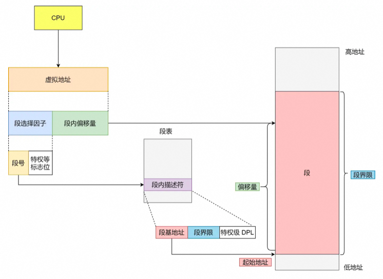
        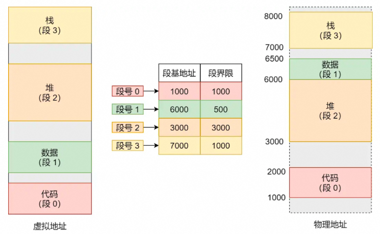
      </div>

      * **虚拟地址 = 段选择因子 + 段内偏移量；段选择因子 = 段号 + 标志位**；可以通过虚拟地址的段号从段表中找到当前虚拟地址对应的**段内描述符**。
      * **段内描述符 = 段基地址 + 段界限 + 特权等级**，可以用段基地址和段界限（段的长度）定位物理地址中当前虚拟所在段的位置和范围。
      * 虚拟地址中的段偏移量介于0和段界限之间，如果段偏移量是合法的，则可以用**段基地址+段偏移量来定位物理地址**。
      * 虚拟地址通过**段表**与物理地址进行映射，**分段机制将整个程序的虚拟地址分成4段（代码+数据+堆+栈）**，每个段在段表中均有对应的一项。

   3. 缺陷：

      * **内存碎片**：主要会出现**外部内存碎片**，即由于每个段的长度不固定，所以多个段未必能恰好使用所有的内存空间，会产生了多个不连续的小物理内存，导致新的程序无法被装载
        * 解决方案：**内存交换**，操作系统将内存中的数据移动到硬盘上的交换文件（swap file）中，以便为其他需要内存空间的进程提供足够的空间（再次从硬盘加载到内存中时填满内存碎片）。内存交换通常发生在内存不足以容纳当前所有进程所需内存的情况下，这会导致系统变得缓慢或不稳定。
      * **内存交换效率低**

3. 内存分页

   1. 理念：**分页是把整个虚拟和物理内存空间切成一段段固定尺寸的大小**。这样一个连续并且尺寸固定的内存空间（页），linux中一般为4KB

   2. 具体实现：

      <div>
        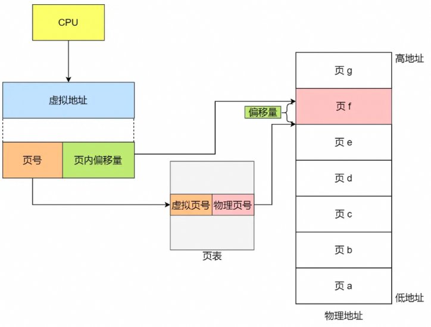
      </div>

      * 虚拟地址与物理地址通过页表来映射，页表存储在内存中，由MMU（内存管理单元)实现虚拟地址到物理地址的转换
      * 虚拟地址=页号 + 页内偏移量；
      * 页表项=虚拟页号+物理页号（4字节）；
      * 物理地址=物理页号+偏移量；

   

   

   

   

   3. 分析：

      * **采用了分页，页与页之间是紧密排列的，不会有外部碎片。**但是，因为内存分页机制分配内存的最小单位是一页，即使程序不足一页大小最少只能分配一个页，所以页内会出现内存浪费，所以针对**内存分页机制会有内部内存碎片**的现象。
      * 如果内存空间不够，操作系统会把其他正在运行的进程中的「**最近没被使用**」的内存页面给释放掉，也就是暂时写在硬盘上，称为**换出**（*Swap Out*）。一旦需要的时候，再加载进来，称为**换入**（*Swap In*）。所以，一次性写入磁盘的也只有少数的一个页或者几个页，不会花太多时间，**内存交换的效率就相对比较高。**
      * 可以在程序运行时不真的把页加载到物理内存里，而是**只有在程序运行中，需要用到对应虚拟内存页里面的指令和数据时，再加载到物理内存里面去。**
      * 缺点：单级页表的实现使得页表本身所占的空间过大，原因是每个进程的虚拟内存空间大小是4GB，页表大小为约4MB，每个进程有各自的页表和内存空间。

   4. 多级页表

      1. 原理：将4MB的二级页表再进行分页，分成1024个一级页表（4MB=4KB * 1024），每个一级页表包含1024个页表项（1024*4字节=4KB），则此时，一级页表就可以覆盖整个 4GB 虚拟地址空间，但**如果某个一级页表的页表项没有被用到，也就不需要创建这个页表项对应的二级页表了，即可以在需要时才创建二级页表**（**局部性原理**）。进一步可以将二级页表推广到多级页表。

      2. 具体原理：32位系统是2级页表，64位系统是4级页表

         <div>
           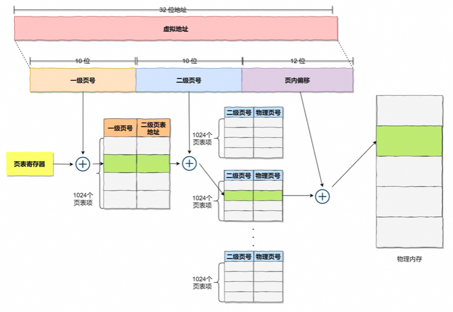
           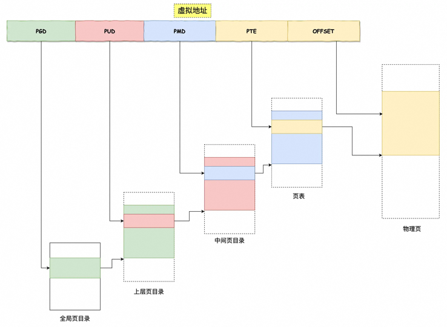
         </div>

         

      3. 缺陷：解决了空间上的问题，但是虚拟地址到物理地址的转换速度下降，时间上的开销增加


## malloc是如何分配内存的

1. linux操作系统的内存分布：

   1. 内核空间与用户空间：`32`位系统的内核空间占用 `1G`，位于最高处，剩下的 `3G` 是用户空间；`64` 位系统的内核空间和用户空间都是 `128T`，分别占据整个内存空间的最高和最低处，剩下的中间部分是未定义的。虽然每个进程都各自有独立的虚拟内存，但是**每个虚拟内存中的内核地址，其实关联的都是相同的物理内存**。进程切换到内核态后，就可以很方便地访问内核空间内存。

   2. 内存空间的构成：

      <div>
        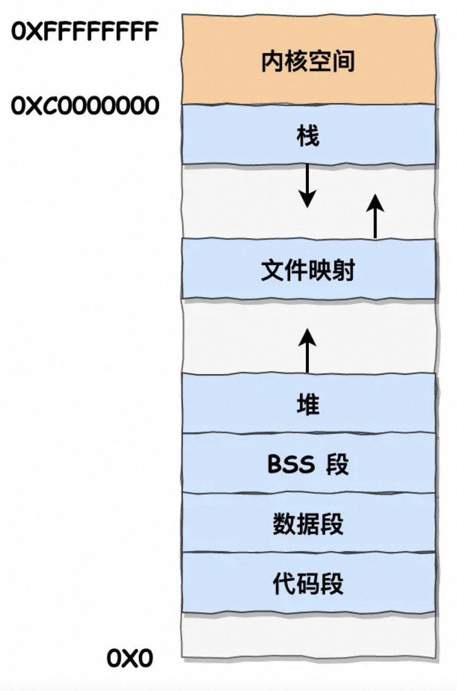
        <p>保留段，由于大多的操作系统会将很小的地址认为是无效的，因此将最下面的空间视作是无效的，常常将null指针指向此地址</p>
        <p>代码段，包括二进制可执行代码；</p>
        <p>数据段，包括已初始化的静态常量和全局变量；</p>
        <p>BSS 段，包括未初始化的静态变量和全局变量；</p>
        <p>堆段，包括动态分配的内存，从低地址开始向上增长，内核中用start_brk标识堆的起始位置，brk标识结束位置，并通过调整brk的指向来伸缩堆大小，实现内存分配；堆上面是待分配区域，用于扩展堆空间</p>
        <p>文件映射段，包括动态库（以及对应的代码段、数据段等）、共享内存等，32位从低地址开始向上增长（跟硬件和内核版本有关 (opens new window)）；64位置从高地址向低地址增长</p>
        <p>栈段，包括局部变量和函数调用的上下文等。栈的大小是固定的，一般是 8 MB。系统也提供了参数，以便自定义大小；每次进程申请新的栈地址时，其地址值是在减少的，内核中使用start_stack标识栈的起始位置，RSP寄存器保存栈顶指针stack pointer，RBP中保存的是栈基地址</p>
        <p>在这 6 个内存段中，堆和文件映射段的内存是动态分配的。</p>
      </div>

      <div>
        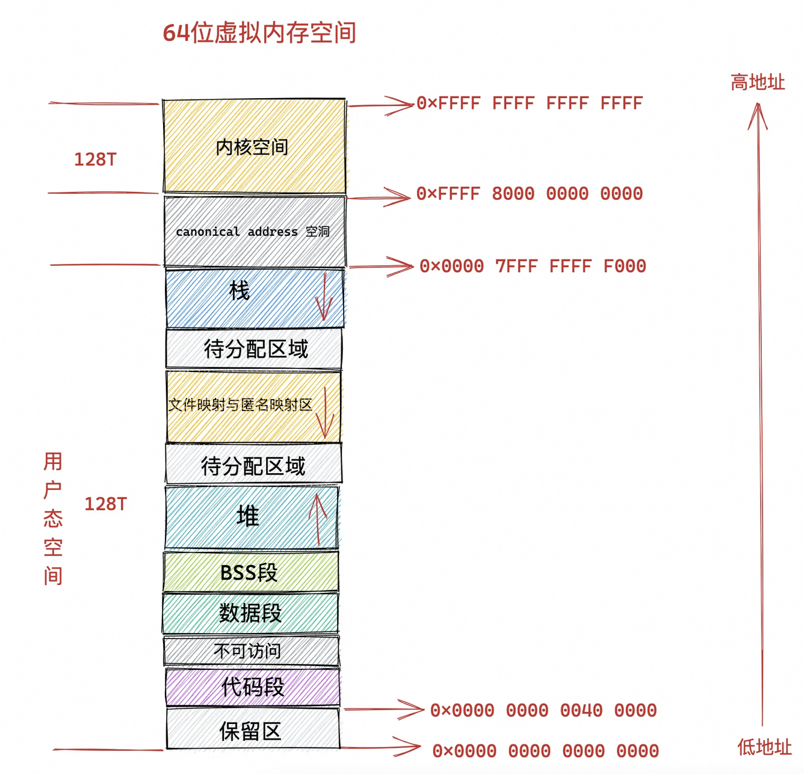
       与32位的内存空间的差别
       1. 由高 16 位空闲地址造成的 canonical address 空洞,在这段范围内的虚拟内存地址是不合法的
      2. 在代码段跟数据段的中间还有一段不可以读写的保护段，它的作用是防止程序在读写数据段的时候越界访问到代码段，这个保护段可以让越界访问行为直接崩溃，防止它继续往下运行。
      3.用户态虚拟内存空间与内核态虚拟内存空间分别占用 128T，其中低128T 分配给用户态虚拟内存空间，高 128T 分配给内核态虚拟内存空间。
      </div>

      

      

      


2. malloc如何分配内存

   1. malloc向系统申请内存的方式：
      * brk()系统调用从堆分配内存：将堆顶指针向高地址一定来获取新的内存空间
      * mmap()系统调用从文件区域获取内存：通过`私有匿名映射`的方式在文件映射区域分配一块内存（**有匿名映射和文件映射两种，具体执行哪一种取决于传递给mmap函数的参数中是否除了大小和权限外还包含文件描述符**）
      * 如果用户分配的内存**小于128KB**通过brk申请，如果**大于128KB**通过mmap申请（此域值是在源码中定义的）（原因如下）

   2. malloc分配的是虚拟内存：如果分配后的虚拟内存没有被访问则不映射到物理内存上；只有在访问已分配的虚拟内存空间的时候操作系统通过查找页表发现虚拟内存对应的空间没有在物理内存中则会触发**缺页中断**，后操作系统建立虚拟内存与物理内存之间的映射关系

   3. malloc分配的内存大小：**会预先分配更大的空间作为内存池**，具体的数值取决于操作系统版本；

   * malloc 通过 **brk()** 方式申请的内存，free 释放内存的时候，**并不会把内存归还给操作系统，而是缓存在 malloc 的内存池中，待下次使用**；
   * malloc 通过 **mmap()** 方式申请的内存，free 释放内存的时候，**会把内存归还给操作系统，内存得到真正的释放**。

   4. 为什么不仅仅使用mmap来分配内存：如果仅仅使用mmap进行内存分配的话，不仅每次都会发生运行态的切换还会在第一次访问该虚拟地址时发生缺页中断（因为每次free都会将内存还给操作系统），使得CPU消耗过大。malloc 通过 brk() 系统调用在堆空间申请内存的时候，由于堆空间是连续的，所以直接预分配更大的内存来作为内存池，当内存释放的时候，就缓存在内存池中。**等下次在申请内存的时候，就直接从内存池取出对应的内存块就行了，而且可能这个内存块的虚拟地址与物理地址的映射关系还存在，这样不仅减少了系统调用的次数，也减少了缺页中断的次数，这将大大降低 CPU 的消耗**。

   5. 为什么不仅仅使用brk来分配内存：由于free是将内存放在内存池中以便后续使用，但若后续申请的空间大于内存池中可以使用的空间，则系统仍会在堆中分配一块更大的空间，则使得实际使用的内存空间继续增大。**并且随着系统频繁地 malloc 和 free ，尤其对于小块内存，堆内将产生越来越多不可用的碎片，导致“内存泄露”。**而这种“泄露”现象使用 valgrind 是无法检测出来的。

   6. free(内存地址)为什么仅仅有一个函数就能知道要释放的内存大小： **malloc 返回给用户态的内存起始地址比进程的堆空间起始地址多了 16 字节，这16个字节即描述了该内存块的信息（如大小）**，则free函数将此地址向左偏移16字节+块大小就是要释放的内存。


## 内存满了如何处理

1. 内存分配的过程
   1. 应用程序通过 malloc 函数申请内存的时候，实际上申请的是虚拟内存，此时并不会分配物理内存。
   2. 当应用程序读写了这块虚拟内存，CPU 就会去访问这个虚拟内存， 这时会发现这个虚拟内存没有映射到物理内存， CPU 就会产生**缺页中断**，进程会从用户态切换到内核态，并将缺页中断交给内核的 Page Fault Handler （缺页中断函数）处理。
   3. 缺页中断处理函数会看是否有空闲的物理内存，如果有，就直接分配物理内存，并建立虚拟内存与物理内存之间的映射关系。
   4. 如果没有空闲的物理内存，那么内核就会开始进行**回收内存**的工作，回收的方式主要是两种：**直接内存回收和后台内存回收**。
2. 内存阈值：
   1. 页最小阈值：剩余内存小于页最小阈值则触发直接内存回收
   2. 页低阈值：剩余内存在最小阈值与低阈值之间则会触发后台内存回收直到剩余内存大于页高阈值
   3. 页高阈值：剩余内存充足
3. 内存回收的种类（程度由低到高）
   1. **后台内存回收**（kswapd）：在物理内存紧张的时候，会唤醒 kswapd 内核线程来回收内存，这个回收内存的过程**异步**的，不会阻塞进程的执行。
   2. **直接内存回收**（direct reclaim）：如果后台异步回收跟不上进程内存申请的速度，就会开始直接回收，这个回收内存的过程是**同步**的，会阻塞进程的执行。
   3. **OOM（out of memory）机制**：如果直接内存回收后，空闲的物理内存仍然无法满足此次物理内存的申请则触发oom机制，OOM Killer 机制会根据算法选择一个占用物理内存较高的进程，然后将其杀死，以便释放内存资源，如果物理内存依然不足，OOM Killer 会继续杀死占用物理内存较高的进程，直到释放足够的内存位置。

3. 可以被回收的内存的种类
   1. **文件页**（File-backed Page）：内核缓存的磁盘数据（Buffer）和内核缓存的文件数据（Cache）都叫作文件页。大部分文件页，都可以直接释放内存，以后有需要时，再从磁盘重新读取就可以了。而那些被应用程序修改过，并且暂时还没写入磁盘的数据（也就是脏页），就得先写入磁盘，然后才能进行内存释放。所以，**回收干净页的方式是直接释放内存，回收脏页的方式是先写回磁盘后再释放内存**。
   2. **匿名页**（Anonymous Page）：这部分内存没有实际载体，比如堆、栈数据等，并且很可能还要再次被访问，所以不能直接释放内存，它们**回收的方式是通过 Linux 的 Swap 机制**，Swap 会把不常访问的内存先写到磁盘中，然后释放这些内存，给其他更需要的进程使用。再次访问这些内存时，重新从磁盘读入内存。
   3. 以上两种内存回收的方法都是基于LRU算法（优先回收不常访问的内存），维护active（最近被访问过的内存页）和inactive（很少被访问的内存页）的两个双向链表。按照类型由可以分成文件页和内存页。

4. 内存回收带来的性能影响

   1. 影响：回收内存操作基本都会带来IO操作，从而影响性能
   2. 文件页和匿名页的回收倾向：更倾向于回收文件页（更少的IO操作），可以通过设置`/proc/sys/vm/swappiness` 选项来调整回收倾向（0-100，表示使用swap的积极程度），默认值为60，推荐为0。
      1. 如何缓解直接内存回收带来的系统抖动：**尽早触发后台回收来避免应用程序进行直接内存回收**，即调大页最小阈值min_free_kbytes来使页低阈值的值对应变大，同时也会导致内存浪费甚至触发oom
   3. 解决方案：
      1. 设置 /proc/sys/vm/swappiness，调整文件页和匿名页的回收倾向，尽量倾向于回收文件页；
      2. 设置 /proc/sys/vm/min_free_kbytes，调整 kswapd 内核线程异步回收内存的时机；
      3. **设置 /proc/sys/vm/zone_reclaim_mode，调整 NUMA 架构下内存回收策略，建议设置为 0，这样在回收本地内存之前，会在其他 Node 寻找空闲内存，从而避免在系统还有很多空闲内存的情况下，因本地 Node 的本地内存不足，发生频繁直接内存回收导致性能下降的问题；**

5. CPU架构与内存回收

   1. SPM架构/UMA架构（一致性存储访问结构）：**多个 CPU 处理器共享资源的电脑硬件架构**，每个 CPU 地位平等，它们共享相同的物理资源，包括总线、内存、IO、操作系统等。每个 CPU 访问内存所用时间都是相同的。问题：随着 CPU 处理器核数的增多，多个 CPU 都通过一个总线访问内存，这样总线的带宽压力会越来越大，同时每个 CPU 可用带宽会减少。
   2. NUMA架构（非一致存储访问结构）：将每个 CPU 进行了分组，每一组 CPU 用 Node 来表示，一个 Node 可能包含多个 CPU 。**每个 Node 有自己独立的资源，包括内存、IO 等**，每个 Node 之间可以通过**互联模块总线（QPI）**进行通信，所以，也就意味着每个 Node 上的 CPU 都可以访问到整个系统中的所有内存。但是，访问远端 Node 的内存比访问本地内存要耗时很多（但比内存回收快很多）。
      * 当某个 Node 内存不足时，系统可以从其他 Node 寻找空闲内存，也可以从本地内存中回收内存。（对应配置默认为 在回收本地内存之前，在其他 Node 寻找空闲内存。）

6. 如何保护一个进程不被oom杀掉

   1. oom原理：根据 `oom_badness()` 函数，其会把系统中可以被杀掉的进程扫描一遍，并对每个进程打分，得分最高的进程就会被首先杀掉。分数受两方面影响，一是进程已经使用的物理内存页面数，二是oom校准值（可以配置，默认为0）。
      * $points = process_pages + oom_score_adj*totalpages/1000$

   2. 如何保护：**oom_score_adj 配置为 -1000使得一个进程无论如何不能被杀掉**，如可以配置sshd等系统进程。


## swap机制

1. 申请的虚拟内存超过物理内存（8G）后会怎么样
   1. 32位操作系统：进程最大只能申请 3 GB 大小的虚拟内存，所以直接申请 8G 内存，会申请失败。
   2. 64位操作系统：进程最大只能申请 128 TB 大小的虚拟内存，即使物理内存只有 4GB，申请 8G 内存也不会出错。（原因是：程序申请的虚拟内存，如果没有被使用，它是不会占用物理空间的。当访问这块虚拟内存后，操作系统才会进行物理内存分配。）
   3. 如果申请物理内存大小超过了空闲物理内存大小（比如一直反复申请1GB的虚拟内存直到程序本身相关数据将物理内存占满），**就要看操作系统有没有开启 Swap 机制：如果没有开启 Swap 机制，程序就会直接 OOM；如果有开启 Swap 机制，程序可以正常运行。**
2. swap机制
   1. 原理：把一块磁盘空间或者本地文件，当成内存来使用
   2. 操作：
      1. **换出（Swap Out）** ，是把进程暂时不用的内存数据存储到磁盘中，并释放这些数据占用的内存；
      2. **换入（Swap In）**，是在进程再次访问这些内存的时候，把它们从磁盘读到内存中来；
   3. 优势：**应用程序实际可以使用的内存空间将远远超过系统的物理内存**
   4. 劣势：**频繁的读写硬盘会显著降低操作系统的运行效率**
   5. 触发场景：
      1. **内存不足**：当系统需要的内存超过了可用的物理内存时，内核会将内存中不常使用的内存页交换到磁盘上为当前进程让出内存，保证正在执行的进程的可用性，这个内存回收的过程是强制的**直接内存回收（Direct Page Reclaim）**。直接内存回收是同步的过程，会阻塞当前申请内存的进程。
      2. **内存闲置**：应用程序在启动阶段使用的大量内存在启动后往往都不会使用，通过**后台运行的守护进程（kSwapd，负责页面置换和交换闲置内存的主要进程）**，可以将这部分只使用一次的内存交换到磁盘上为其他内存的申请预留空间。kSwapd 是后台进程，所以回收内存的过程是异步的，不会阻塞当前申请内存的进程。
   6. 开启方式：
      1. **swap分区**：硬盘上的独立分区，该区域只会用于交换分区，其他文件无法存储
      2. **swap文件**：文件系统中的特殊文件
   7. 内存类型：内核缓存均有对应的磁盘文件，在回收数据时直接写入对应的磁盘文件即可，类似于堆、栈的没有实际载体的**匿名页**数据很可能要再次被访问而无法直接释放，存储在swap分区中


## LRU算法

1. linux（page cache）和mysql（buffer pool）的缓存
2. 传统LRU算法（least recently used）
   1. 思路：当访问的页在内存里，就直接把该页对应的 LRU 链表节点移动到链表的头部。当访问的页不在内存里，除了要把该页放入到 LRU 链表的头部，还要淘汰 LRU 链表末尾的页。
   2. **预读机制**：应用程序只想读取一个页的数据，但是操作系统由于局部性原理选择额外顺序读取3个页到内存中，则使得下一次访问后面的数据就不需要再访问磁盘了，减少了磁盘IO的次数，提升了系统磁盘IO吞吐量。
   3. **缓存污染**：在批量读取数据的时候，由于数据被访问了一次，这些大量数据都会被加入到「活跃 LRU 链表」里，然后之前缓存在活跃 LRU 链表（或者 young 区域）里的热点数据全部都被淘汰了，**如果这些大量的数据在很长一段时间都不会被访问的话，那么整个活跃 LRU 链表（或者 young 区域）就被污染了**。
3. 如何处理预读失败的问题
   1. 预读失败：传统LRU算法会将预读的页放在LRU链表的头部，并且会在内存不够时淘汰末尾的页，若此部分数据一直不被访问，就导致预读失败，并且这部分数据会导致可能的热点数据被淘汰，降低了缓存命中率。
   2. 如何避免：**让预读页停留在内存里的时间要尽可能的短，让真正被访问的页才移动到 LRU 链表的头部，从而保证真正被读取的热数据留在内存里的时间尽可能长**。
      1. Linux 操作系统实现两个了 LRU 链表：**活跃 LRU 链表（active_list）和非活跃 LRU 链表（inactive_list）**，**预读页就只需要加入到 inactive list 区域的头部，当页被真正访问的时候，才将页插入 active list 的头部**。如果预读的页一直没有被访问，就会从 inactive list 移除，这样就不会影响 active list 中的热点数据。
      2. MySQL 的 Innodb 存储引擎是在一个 LRU 链表上划分来 2 个区域，**young 区域 和 old 区域**。young 区域在 LRU 链表的前半部分，old 区域则是在后半部分，这两个区域都有各自的头和尾节点，young 区域与 old 区域在 LRU 链表中的占比关系并不是一比一的关系，而是 63:37（默认比例）的关系。**划分这两个区域后，预读的页就只需要加入到 old 区域的头部，当页被真正访问的时候，才将页插入 young 区域的头部**。如果预读的页一直没有被访问，就会从 old 区域移除，这样就不会影响 young 区域中的热点数据。
4. 如何处理缓存污染的问题
   1. 缓存污染导致的问题：当被刷新的热数据重新被访问时，由于缓存未命中就会产生大量的磁盘IO，使得系统性能快速下降（如SQL读表并计算）
   2. 如何避免：**提高进入到活跃 LRU 链表（或者 young 区域）的门槛，就能有效地保证活跃 LRU 链表（或者 young 区域）里的热点数据不会被轻易替换掉**。
      1. linux在内存页被访问**第二次**的时候，才将页从 inactive list 升级到 active list 里。
      2. MySQL Innodb在内存页被访问**第二次**的时候，并不会马上将该页从 old 区域升级到 young 区域，因为还要进行**停留在 old 区域的时间判断**,
         - 如果第二次的访问时间与第一次访问的时间**在 1 秒内**（默认值），那么该页就**不会**被从 old 区域升级到 young 区域
         - 如果第二次的访问时间与第一次访问的时间**超过 1 秒**，那么该页就**会**从 old 区域升级到 young 区域


## 深入理解linux虚拟内存管理

1. 什么是虚拟内存地址

   1. 虚拟地址格式：

      * 64位虚拟地址：全局页目录项（9位）+ 上层页目录项（9位）+ 中间页目录项（9位）+ 页表项（9位）+ 页内偏移（12位），共48位。对应内存空间范围是256TB（128TB内核（0xFFFF开头）+128TB用户（0x0000开头），中间剩余部分即高16位地址形成的canonical address 空洞（0x0000 7FFF FFFF F000 - 0xFFFF 8000 0000 0000 ））。

      * 32位虚拟地址：页目录项（10位）+ 页表项（10位） + 页内偏移（12位），共 32 位。对应内存空间范围是4GB（1GB内核+3GB用户）。

   2. 进程虚拟内存空间中的每一个字节都有与其对应的虚拟内存地址，一个虚拟内存地址表示进程虚拟内存空间中的一个特定的字节。

2. 为什么要使用虚拟地址访问内存

   1. 

3. 用户态进程虚拟内容空间：32位和64位的用户虚拟空间组成

4. linux进程虚拟内存空间

   1. Task_struct结构/mm_struct结构：

      1. 在进程描述符 task_struct 结构中，有一个专门描述进程虚拟地址空间的内存描述符 mm_struct 结构，其中包含了进程虚拟内存空间的全部信息，每个进程都有唯一的 mm_struct 结构体，即每个进程的虚拟地址空间都是独立，互不干扰的。

      ```java
      struct task_struct {
            // 进程id
      	    pid_t	 pid;
            // 用于标识线程所属的进程 pid
      	    pid_t	 tgid;
            // 进程打开的文件信息
            struct files_struct		*files;
            // 内存描述符表示进程虚拟地址空间
            struct mm_struct	*mm;
      
              .......... 省略 .......
      }
      ```

      2. 当调用 fork() 函数创建进程的时候，表示进程地址空间的 mm_struct 结构会随着进程描述符 task_struct 的创建而创建。**子进程在新创建出来之后它的虚拟内存空间是和父进程的虚拟内存空间一模一样的，直接拷贝过来**。然而，通过 vfork 或者 clone 系统调用创建出的子进程会使得子进程共享父进程的虚拟内存空间，**也就是说父子进程之间使用的虚拟内存空间是一样的，并不是一份拷贝，此时的子进程就是线程**。

      ```java
      long _do_fork(unsigned long clone_flags,
      	      unsigned long stack_start,
      	      unsigned long stack_size,
      	      int __user *parent_tidptr,
      	      int __user *child_tidptr,
      	      unsigned long tls)
      {
              ......... 省略 ..........
      	struct pid *pid;
      	struct task_struct *p;
      
              ......... 省略 ..........
          // 为进程创建 task_struct 结构，用父进程的资源填充 task_struct 信息
      	p = copy_process(clone_flags, stack_start, stack_size,
      			 child_tidptr, NULL, trace, tls, NUMA_NO_NODE);
      
               ......... 省略 ..........
      }
      ```

      3. **内核线程和用户态线程的区别就是内核线程没有相关的内存描述符 mm_struct** ，内核线程对应的 task_struct 结构中的 mm 域指向 Null，所以内核线程之间调度是不涉及地址空间切换的。当一个内核线程被调度时，它会发现自己的虚拟地址空间为 Null，虽然它不会访问用户态的内存，但是它会访问内核内存。**内核会将调度之前的上一个用户态进程的虚拟内存空间 mm_struct 直接赋值给内核线程，因为内核线程不会访问用户空间的内存，它仅仅只会访问内核空间的内存，所以直接复用上一个用户态进程的虚拟地址空间就可以避免为内核线程分配 mm_struct 和相关页表的开销，以及避免内核线程之间调度时地址空间的切换开销。**

   2. 内核如何划分用户态和内核态虚拟空间：进程的内存描述符 mm_struct 结构体中的 task_size 变量，**task_size 定义了用户态地址空间与内核态地址空间之间的分界线**。32 位系统中用户地址空间和内核地址空间的分界线在 **0xC000 000 地址**处（3G）。64 位系统中用户地址空间和内核地址空间的分界线在 **0x0000 7FFF FFFF F000** 地址处（==128T=0x0000800000000000-page_size(4K)==）。

   3. 内核如何布局进程虚拟内存空间

      ```java
      struct mm_struct {
          struct vm_area_struct *mmap;		/* VMAs构成的链表的头指针，用于高效遍历 */
          struct rb_root mm_rb;           /* VMAs构成的红黑树的的根节点，用于高效查找 */
          unsigned long task_size;    /* 用户虚拟内存空间与内科虚拟内存空间的分界*/
          /*下面定义此内存空间中相关具体子虚拟内存区域的大小/范围等信息，对应多个VAMs*/
          unsigned long start_code, end_code, start_data, end_data;
          /*代码段数据段后面紧跟BSS段，其大小是固定的*/
          /*堆的范围、栈的起始位置（bp寄存器中）栈顶指针在sp寄存器中*/
          unsigned long start_brk, brk, start_stack;  
          /*代表参数列表和环境变量的位置，位于栈中的最大哦地址处*/
          unsigned long arg_start, arg_end, env_start, env_end; 
          unsigned long mmap_base;  /* 内存映射区地址，从高地址到低地址 */
          /*定义了一些虚拟内存与物理内存映射内容相关的统计变量，是按照页来进行管理的*/
          unsigned long total_vm;    /* Total pages mapped */
          unsigned long locked_vm;  /* 内存不够时也不能被换出的页总数 */
          unsigned long pinned_vm;  /* 不能被换出也不能被移动的页总数 */
          unsigned long data_vm;    /* 数据段中映射的内存页总数 */
          unsigned long exec_vm;    /* 内存页中存放可执行文件的内存页总数 */
          unsigned long stack_vm;    /* 栈中所映射的内存页数 */
      
             ...... 省略 ........
      }
      ```

   4. 内核如何管理虚拟内存区域：上述的虚拟内存区域（VMA）在内核均对应了一个vm_area_struct结构，设定了虚拟内存区域对应的范围以及权限，虚拟内存区域对应的权限也会完全复制到其中包含的多个内存页中。

      ```java
      struct vm_area_struct {
        /*范围：[vm_start，vm_end) */
      	unsigned long vm_start; /* 虚拟内存区域的起始地址/最低地址，该变量本身就在虚拟区域内 */
      	unsigned long vm_end;		/* 虚拟内存区域的结束地址/最高地址，该变量本身包含在这块虚拟内存区域之外 */
      	pgprot_t vm_page_prot;  /* 定义页表中关于内存页的访问权限*/
        /* 整个虚拟内存区域的访问权限以及行为规范 */
        /* 如可读、可写、可执行、可多进程间共享、可映射至设备IO空间（如mmap内存空间映射）*/
        /* 内存区域不可被换出（内存紧张时不swap）、内存区域可能被顺序访问（预读)、内存区域可能被随机访问（减少预读或停止） */
      	unsigned long vm_flags;	
      	struct anon_vma *anon_vma;	/* mmap执行匿名映射时在文件映射与匿名映射区创建出的内存区域，对应下面两个属性为空 */
        struct file * vm_file;		/* mmap执行文件映射时将内存映射到的文件，需要锁 */
      	unsigned long vm_pgoff;		/* mmap执行文件映射时映射进内存的文件内容在文件中的偏移量（以页为单元）*/	
      	void * vm_private_data;		/* vma中的私有数据，与存储内容和内存映射类型相关 */
      	/* 下面的结构中定义了与当前虚拟内存区域相关的操作 */
      	const struct vm_operations_struct *vm_ops; 
      }
      ```

   5. 如何关联内存映射中的映射关系：虚拟内存区域可以映射到物理内存上（**匿名映射**），也可以映射到文件上（**文件映射**）；具体通过以上三个属性 anon_vma，vm_file，vm_pgoff 来指定

   6. 如何针对虚拟内存区域执行相关操作： struct vm_area_struct 结构中还有一个 vm_ops 用来指向针对虚拟内存区域 VMA 的相关操作的**函数指针**（**定义的是相关操作函数指针，具体的函实现会根据不同的类型而不同**）

      ```java
      struct vm_operations_struct {
          //当指定的虚拟内存区域被加入到进程虚拟内存空间中时，调用open
      	  void (*open)(struct vm_area_struct * area); 
          //当虚拟内存区域 VMA 从进程虚拟内存空间中被删除时，调用close
      	  void (*close)(struct vm_area_struct * area);
          //当进程访问虚拟内存时，访问的页面不在物理内存中
          //可能是未分配物理内存也可能是被置换到磁盘中，产生缺页异常，调用fault
          vm_fault_t (*fault)(struct vm_fault *vmf);
          //当一个只读的页面将要变为可写时，调用page_mkwrite
          vm_fault_t (*page_mkwrite)(struct vm_fault *vmf);
      
          ..... 省略 .......
      }
      ```

   7. 虚拟内存区域在内核中是如何被组织的：内核是通过一个 struct vm_area_struct 结构的双向链表将虚拟内存空间中的这些虚拟内存区域 VMA 串联起来的。内核中的 VMA 双向链表是有顺序的，所有 VMA 节点按照低地址到高地址的增长方向排序。双向链表中的最后一个 VMA 节点的 vm_next 指针指向 NULL，**双向链表的头指针存储在内存描述符`mm_struct` 结构中的 mmap 中**（见上面的mm_struct结构），并且在内核中，同样的内存区域 vm_area_struct 会有两种组织形式，一种是双向链表用于高效的遍历，另一种就是红黑树用于高效的查找

      ```java
      struct vm_area_struct {
        //VMA节点所在双向链表中的后继节点和前驱节点
      	struct vm_area_struct *vm_next, *vm_prev;
        //VMA节点所在红黑树中的位置
      	struct rb_node vm_rb;
        struct list_head anon_vma_chain; 
        //所属的内存区域 mm_struct结构即进程对应的虚拟内存空间 反向指向表示属于关系
      	struct mm_struct *vm_mm;	 
        /* ···· 省略 ······（与上文相同）*/
       
      }
      ```

      ```java
      struct mm_struct {
          struct vm_area_struct *mmap;		/* VMAs构成的链表的头指针，用于高效遍历 */
          struct rb_root mm_rb;           /* VMAs构成的红黑树的的根节点，用于高效查找 */
      }
      ```

   8. 整体结构如下：

      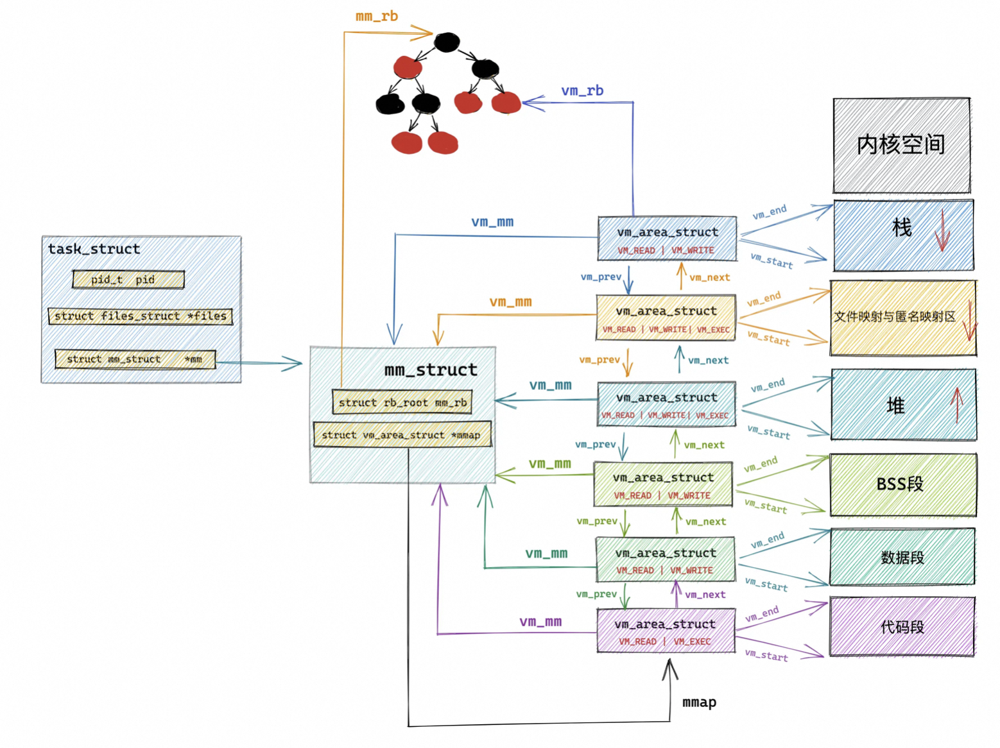

5. 程序编译后的二进制文件如何映射到虚拟空间中/进程的虚拟内存空间和虚拟内存区域如何被创建和初始化

   1. 程序代码的编译产物：程序代码编译之后会生成一个 **ELF 格式的二进制文件**，一段一段得包含了程序运行时所需要的元信息，比如程序的机器码，程序中的全局变量以及静态变量等。ELF文件对应的磁盘文件中的这些 **Section（磁盘文件的段）** 会在进程运行之前加载到内存中并映射到内存中的 **Segment（内存空间中的段）**。**通常是多个 Section 映射到一个 Segment**。比如磁盘文件中的 .text，.rodata 等一些只读的 Section，会被映射到内存的一个只读可执行的 Segment 里（代码段）。而 .data，.bss 等一些可读写的 Section，则会被映射到内存的一个具有读写权限的 Segment 里（数据段，BSS 段）。

   2. section如何映射到segment中：依靠`load_elf_binary`函数（**作用：加载内核，启动第一个用户态进程 init ，fork 后调用 exec 运行一个二进制程序等**）

      ```java
      static int load_elf_binary(struct linux_binprm *bprm)
      {
            ...... 省略 ........
        // 设置虚拟内存空间中的内存映射区域起始地址 mmap_base
        setup_new_exec(bprm);
      
           ...... 省略 ........
        // 创建并初始化栈对应的 vm_area_struct 结构。
        // 设置 mm->start_stack 就是栈的起始地址也就是栈底，并将 mm->arg_start 是指向栈底的。
        retval = setup_arg_pages(bprm, randomize_stack_top(STACK_TOP),executable_stack);
      
           ...... 省略 ........
        //  ELF 格式的二进制文件中.text ，.data，.bss 部分映射到虚拟内存空间中的代码段，数据段，BSS 段中
        error = elf_map(bprm->file, load_bias + vaddr, elf_ppnt, elf_prot, elf_flags, total_size);
      
           ...... 省略 ........
        // 创建并初始化堆对应的的 vm_area_struct 结构
        // 设置 current->mm->start_brk = current->mm->brk
        // 设置堆的起始地址 start_brk，结束地址 brk。 起初两者相等表示堆是空的
        retval = set_brk(elf_bss, elf_brk, bss_prot);
      
           ...... 省略 ........
        // 将进程依赖的动态链接库 .so 文件映射到虚拟内存空间中的内存映射区域
        elf_entry = load_elf_interp(&loc->interp_elf_ex, interpreter, &interp_map_addr, load_bias, interp_elf_phdata);
      
           ...... 省略 ........
        // 初始化内存描述符 mm_struct
        current->mm->end_code = end_code;
        current->mm->start_code = start_code;
        current->mm->start_data = start_data;
        current->mm->end_data = end_data;
        current->mm->start_stack = bprm->p;
      
           ...... 省略 ........
      }
      ```

6. 内核虚拟内存空间

   （仍然是虚拟地址空间，内核态对应的虚拟内存空间，下面以32位为例，32位系统中为0xC000 000 - 0xFFFF FFFF）

   1. 直接映射区/物理映射区：

      1. 位置与映射方式：**内核态虚拟内存空间的前 896M 区域是直接映射到物理内存中的前 896M 区域中的，直接映射区中的映射关系是一比一映射。映射关系是固定的不会改变**。虽然这块区域中的虚拟地址是直接映射到物理地址上，但是内核在访问这段区域的时候还是走的虚拟内存地址，内核也会为这块空间建立映射页表，但是**页表中的对应关系是不会改变的**。
      2. 内容：
         * **前 1M 已经在系统启动的时候被系统占用，1M 之后的物理内存存放的是内核代码段，数据段，BSS 段（这些信息起初存放在 ELF格式的二进制文件中，在系统启动的时候被加载进内存）。**
         * fork 系统调用创建进程的时候，内核会创建一系列**进程相关的描述符**，比如 task_struct、mm_struct、 vm_area_struct 等，这些数据也被存储在存储在物理内存前896M区域中并映射到内核态虚拟内存空间的对应位置中。
         * 当进程被创建完毕之后，在内核运行的过程中，会涉及内核栈的分配，**内核会为每个进程分配一个固定大小的内核栈（一般是两个页大小，依赖具体的体系结构，容量小且固定）**，**每个进程的整个调用链必须放在自己的内核栈中**，内核栈也是分配在直接映射区。
         * 从功能的角度进行划分：**ZONE_DMA**（实际的计算机体系结构受到硬件方面的限制制约，ISA 总线的 DMA （直接内存存取）控制器，只能对内存的前16M 进行寻址，这就导致了 ISA 设备不能在整个 32 位地址空间中执行 DMA，只能使用物理内存的前 16M 进行 DMA 操作，直接映射区的前 16M 专门让内核用来为 DMA 分配内存） 、**ZONE_NORMAL**（直接映射区中剩下的部分也就是从 16M 到 896M（不包含 896M）这段区域，我们称之为 ZONE_NORMAL，是正常的页表，**操作系统占用的1M以及其他系统描述符均属于ZONE_NORNAL**）

   2. ZONE_HIGHMEM高端内存与vmalloc动态映射区（32位才有）

      1. 物理内存位置与映射方式：物理内存 896M 以上的区域（对应的内核虚拟内存空间大小仅剩1G-896M=128M），采用**动态映射**的方式进行（只能动态的一部分一部分的分批映射，先映射正在使用的这部分，使用完毕解除映射，接着映射其他部分）
      2. 虚拟内存位置：内核虚拟内存空间中的 3G + 896M 这块地址在内核中定义为 high_memory，high_memory 往上有一段 8M 大小的内存空洞。**空洞范围为：high_memory 到 VMALLOC_START 。**接下来 **VMALLOC_START 到 VMALLOC_END** 之间的这块区域成为动态映射区。
      3. 动态映射方式：**内核对动态映射区采用vmalloc进行内存分配**，**其在虚拟内存上是连续的但是对应的物理内存是不连续的**，通过页表建立物理内存和虚拟内存之间的映射关系（由于物理内存不连续因此需要一个一个得进行映射，在性能开销上会比直接映射大很多）

   3. 永久映射区

      1. 虚拟内存位置：**在 PKMAP_BASE 到 FIXADDR_START 之间的这段空间称为永久映射区。在内核的这段虚拟地址空间中允许建立与物理高端内存的长期映射关系。**（例如：内核通过 alloc_pages() 函数在物理内存的高端内存中申请获取到的物理内存页，这些物理内存页可以通过调用 kmap 映射到永久映射区中。）LAST_PKMAP 表示永久映射区可以映射的页数限制。

   4. 固定映射区

      1. 虚拟内存位置：**在FIXADDR_START 到 FIXADDR_TOP之间的这段空间称为固定映射区，在固定映射区中的虚拟内存地址可以自由映射到物理内存的高端地址上**，但是与动态映射区以及永久映射区不同的是，**在固定映射区中虚拟地址是固定的，而被映射的物理地址是可以改变的**。
      2. 作用：内核固定分配了一些虚拟地址，这些地址有固定的用途，使用该地址的模块在初始化的时候，将这些固定分配的虚拟地址映射到指定的物理地址上去。

   5. 临时映射区：内核虚拟内存中的剩余部分，保存临时的变量

   6. 整体结构如下：

      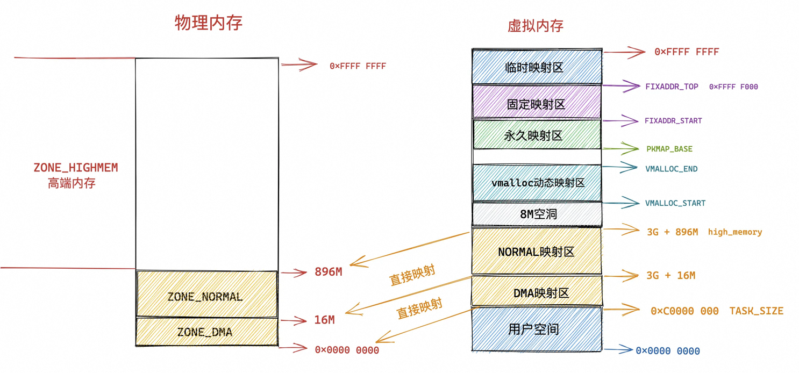

      7. 64位体系的内核虚拟内存空间的布局

         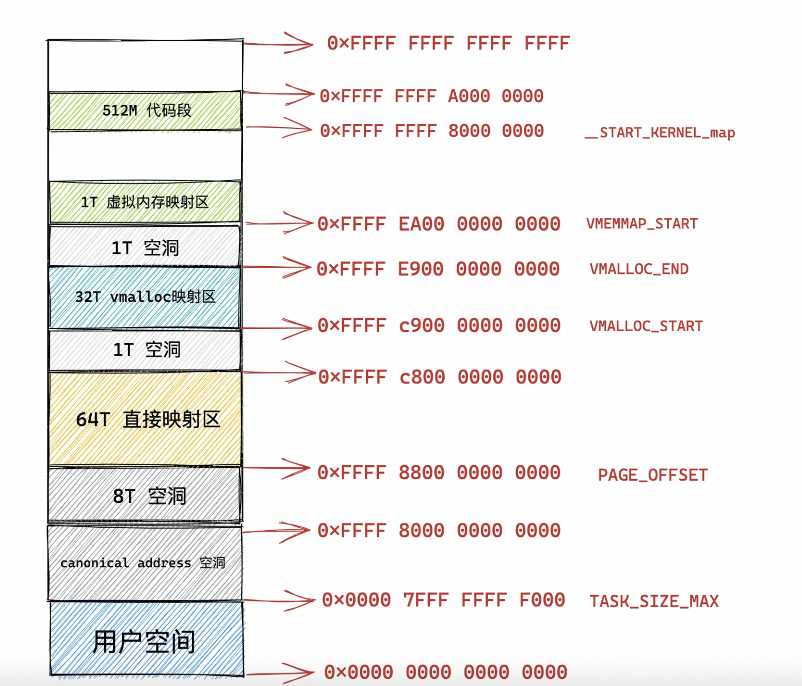

7. 到底什么是物理内存地址

   1. 主存结构：存储控制器+ 存储器模块（DRAM芯片），每个存储器模块中包含8个DRAM芯片，编号从0-7。

   2. DRAM芯片的结构：二维矩阵，其中存储的元素称为超单元，每个超单元的大小为8bit，并由一个坐标地址（i,j）指定；DRAM中的信息通过引脚流入和流出芯片（地址引脚和数据引脚），每个引脚带有1bit的信号。

   3. DRAM芯片的访问：DRAM 芯片的 IO 单位为一个 supercell ，也就是一个字节(8 bit)。在物理内存地址对应的存储器模块中，DRAM0 芯片存储第一个低位字节（ supercell ），DRAM1 芯片存储第二个字节，......依次类推 DRAM7 芯片存储最后一个高位字节。则从 DRAM0 到 DRAM7 依次从位置（i, j）处读取到了 8 个 supercell 就相当于读取了8 个字节。即**CPU 总是以 word size 为单位从内存中读取数据，在 64 位处理器中的 word size 为 8 个字节。64 位的内存每次只能吞吐 8 个字节，内存一次读取和写入的单位是 8 个字节。CPU 每次会向内存读写一个 cache line 大小的数据（ 64 个字节），但是内存一次只能吞吐 8 个字节。**即看似连续的物理地址中的8个字节实际上是不连续的。

      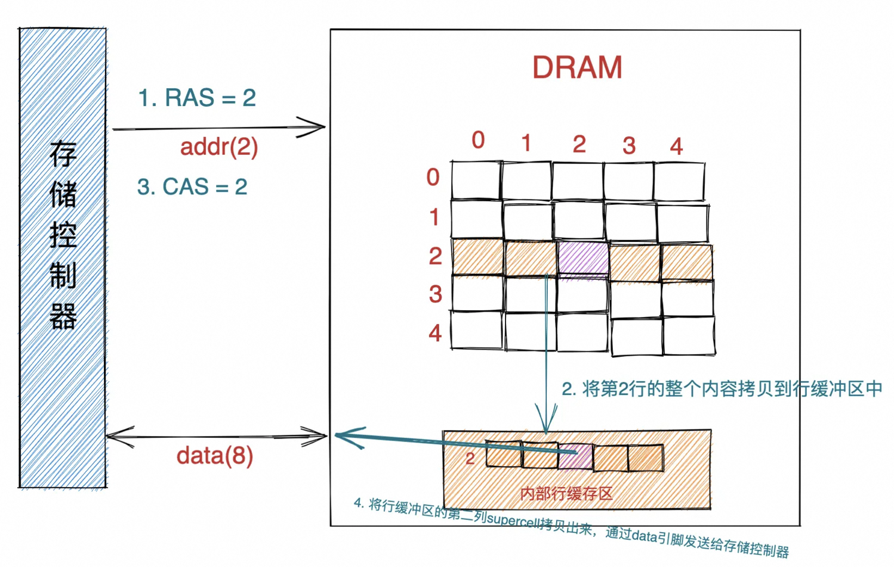

   4. CPU与主存之间的结构关系：

      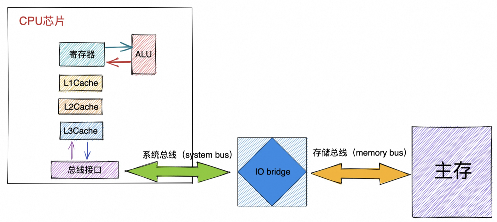

      1. 总线事务：CPU与内存之间的数据交互通过总线完成，数据在总线上的传送通过一系列的步骤完成即总线事务，数据从内存传送到CPU即为读事务，数据从CPU传送到内存即为写事务。总线上的信号有**地址信号、控制信号（用于同步事务，并标识出当前正在被执行的事务信息）、数据信号**。**总线上传输的地址是物理内存地址（总线嗅探的也是物理内存地址）**，因此CPU在操作总线之间需要将虚拟内存地址钻换成物理内存地址。**系统总线是连接 CPU 与 IO bridge 的，存储总线是来连接 IO bridge 和主存的**。
      2. IO bridge：负责将系统总线上的电子信号转换成存储总线上的电子信号，也将系统总线和存储总线连接到IO总线上（如IO设备）

   5. CPU从内存读取数据的过程：CPU芯片中的总线接口在总线上发起读事务，并开始从内存中读取数据。

      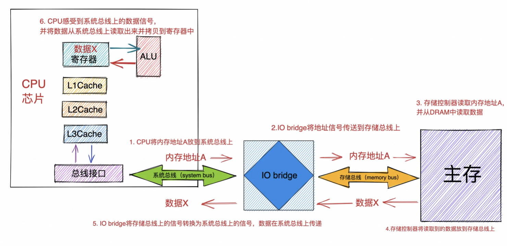

   6. CPU向内存中写入数据的过程：CPU 芯片中的总线接口会向总线发起写事务（write transaction）。写事务步骤如下：

      1. CPU 将要写入的物理内存地址 A 放入系统总线上。
      2. 通过 IO bridge 的信号转换，将物理内存地址 A 传递到存储总线上。
      3. 存储控制器感受到存储总线上的地址信号，将物理内存地址 A 从存储总线上读取出来，并等待数据的到达。
      4. CPU 将寄存器中的数据拷贝到系统总线上，通过 IO bridge 的信号转换，将数据传递到存储总线上。
      5. 存储控制器感受到存储总线上的数据信号，将数据从存储总线上读取出来。
      6. 存储控制器通过内存地址 A 定位到具体的存储器模块，最后将数据写入存储器模块中的 8 个 DRAM 芯片中。


## 深入理解linux物理内存管理

1. 物理内存模型（如何维护struct page和对应的索引pfn的一一对应关系，page_to_pfn/pfn_to_page）
   1. FLATMEM平坦内存模型：直接将**连续的物理内存划分成连续的固定大小的物理页**，并且将连续的struct page组织到 mem_map 全局数组中，对应的下标即为pfn，对应的一一对应关系直接基于数据进行偏移量操作。内核中默认配置的是FLATMEM平坦模型。**其缺点在于对于非连续的物理地址其对应的mem_map中就会存在非常多的struct page（40byte/个）空洞，从而造成内存浪费。**
   2. DISCONTIGMEM非连续内存模型：**内核将物理内存从宏观上划分成了一个一个的节点 node （微观上还是一页一页的物理页），每个 node 节点管理一块连续的物理内存。**内核中使用 struct pglist_data 表示用于管理连续物理内存的 node 节点（内核假设 node 中的物理内存是连续的），每个 node 节点中还是采用 FLATMEM 平坦内存模型的方式来组织管理物理内存页。每个 node 节点中包含一个 `struct page *node_mem_map` 数组，用来组织管理 node 中的连续物理内存页。pfn到page的定位需要额外加上对于page所在node的计算，后续则和FLATMEM模型相同。
   3. SPARSMEM稀疏内存模型：内核可以支持物理内存的热插拔，即node中的物理内存也不一定是连续的，并且每个node内部都有完整的内存管理系统，为了避免node数目过多带来的开销过大产生了稀疏内存模型。其核心思想是心思想就是**对粒度更小的连续内存块进行精细的管理**，**用于管理连续内存块的单元被称作 section** 。物理页大小为 4k 的情况下， section 的大小为 128M ，物理页大小为 16k 的情况下， section 的大小为 512M。mem_section中有一个section_mem_map指针指向其中用于管理连续内存的page数组。所有的mem_section被放在一个全局数据中并且可以系统运行时随意上线/下线从而支持物理内存的热插拔。pfn和struct page中的flag标志位的高bit位中存储了page到section的对应关系。
      1. 物理内存热插拔：当 mem_section offline 时, 内核会把这部分内存隔离开, 使得该部分内存不可再被使用, 后将mem_section 中已经分配的内存页迁移到其他 mem_section 的内存上。并且需要保证迁移带来的物理内存的变化需要对进程透明即对应的虚拟内存地址是不能变化的（对于用户空间来说是没有问题的只需要对应修改页表即可）。然而内核空间中有部分的页是不能迁移的，如直接映射区中的物理页的虚拟地址会随着物理内存地址变动而变动（其物理地址和虚拟地址的对应关系是固定的）,因此操作系统会**将物理内存按照是否可以迁移进行分类（不可迁移页、可回收页、可迁移页）**，将可以迁移的内存放在可插拔的物理内存中。

2. 物理内存架构（多核CPU）

   1. 一致性访问UMA架构（**同一个 CPU 对所有内存的访问的速度是一样的**）

      1. 方式：在 UMA 架构下，多核服务器中的多个 CPU 位于总线的一侧，所有的内存条组成一大片内存位于总线的另一侧，所有的 CPU 访问内存都要过总线，而且距离都是一样的，由于**所有 CPU 对内存的访问距离都是一样的**，所以在 UMA 架构下所有 CPU 访问内存的速度都是一样的。这种访问模式称为 **SMP（Symmetric multiprocessing），即对称多处理器**。
      2. 缺点：总线的带宽压力会越来越大，随着 CPU 个数的增多导致每个 CPU 可用带宽会减少；总线的长度也会因此而增加，进而增加访问延迟
      3. 物理内存模型：上述的三种物理内存模型都可以使用

   2. 非一致性内存访问NUMA架构（**CPU 访问内存的速度不一致**）

      1. 方式：内存就不是一整片的了，而是被划分成了一个一个的内存节点 （NUMA 节点），**每个 CPU 都有属于自己的本地内存节点（也可以多个CPU核共享一个本地内存节点），CPU 访问自己的本地内存不需要经过总线，访问速度是最快的。当 CPU 自己的本地内存不足时，CPU 就需要跨节点去访问其他内存节点，访问内存速度较慢**。**任意一个 CPU 都可以访问全部的内存节点**，访问自己的本地内存节点是最快的，但访问其他内存节点就会慢很多（不同numa之间的距离不同），这就导致了 CPU 访问内存的速度不一致。**CPU 和它的本地内存组成了 NUMA 节点，CPU 与 CPU 之间通过 QPI（Intel QuickPath Interconnect）点对点完成互联，在 CPU 的本地内存不足的情况下，CPU 需要通过 QPI 访问远程 NUMA 节点上的内存控制器从而在远程内存节点上分配内存，这就导致了远程访问比本地访问多了额外的延迟开销（需要通过 QPI 遍历远程 NUMA 节点）。**

      2. 物理内存模型：只可以使用**非连续性模型和稀疏内存模型**

      3. 内存分配策略：可以通过配置实现仅仅在本地内存分配超出就swap/在本地内存和远程内存分配/在本地内存和离的最近的节点分配等。

      4. 内核如何管理numa节点：

         1. uma架构和numa架构在内核中对应的数据结构是相同的，即会将uma架构当成是只有一个节点的numa架构

         2. 多个numa节点在内核中以单链表或**全局数组node_data （类型是pglist_data，大小为MAX_NUMNODES）**的形式进行管理

         3. 节点描述符pglist_data结构： 系统中所有 NUMA 节点中的物理页都是依次编号的，每个物理页的 PFN 都是**全局唯一的**

            ```java
            typedef struct pglist_data {
                // NUMA 节点id
                int node_id;
                // 指向 NUMA 节点内管理所有物理页 page 的数组
                struct page *node_mem_map;
                // NUMA 节点内第一个物理页的 pfn
                unsigned long node_start_pfn;
                // NUMA 节点内所有可用的物理页个数（不包含内存空洞）
                unsigned long node_present_pages;
                // NUMA 节点内所有的物理页个数（包含内存空洞）
                unsigned long node_spanned_pages; 
                // 保证多进程可以并发安全的访问 NUMA 节点
                spinlock_t node_size_lock;
                    .............
            }
            ```

         4. nmua节点物理内存区域的划分

            * ZONE_DMA：用于那些无法对全部物理内存进行寻址的硬件设备，进行 DMA 时的内存分配。例如前边介绍的 ISA 设备只能对物理内存的前 16M 进行寻址。该区域的长度依赖于具体的处理器类型。

            * ZONE_DMA32：与 ZONE_DMA 区域类似，该区域内的物理页面可用于执行 DMA 操作，不同之处在于该区域是提供给 32 位设备（只能寻址 4G 物理内存）执行 DMA 操作时使用的。该区域只在 64 位系统中起作用，因为只有在 64 位系统中才会专门为 32 位设备提供专门的 DMA 区域。

            * ZONE_NORMAL：这个区域的物理页都可以直接映射到内核中的虚拟内存，由于是线性映射，内核可以直接进行访问。

            * ZONE_HIGHMEM：这个区域包含的物理页就是我们说的高端内存，内核不能直接访问这些物理页，这些物理页需要动态映射进内核虚拟内存空间中（非线性映射）。该区域只在 32 位系统中才会存在，因为 64 位系统中的内核虚拟内存空间太大了（128T），都可以进行直接映射。

            * ZONE_DEVICE 是为支持热插拔设备而分配的非易失性内存（ Non Volatile Memory ），也可用于内核崩溃时保存相关的调试信息。

            * ZONE_MOVABLE 是内核定义的一个**虚拟内存区域（是内核对物理区域从逻辑上的划分）**，该区域中的物理页可以来自于上边介绍的几种真实的物理区域。该区域中的页全部都是可以迁移的，主要是为了**防止内存碎片和支持内存的热插拔**。（内核中请求分配的物理页面数只能是 2 的次幂）

              ```java
              typedef struct pglist_data {
                // NUMA 节点中的物理内存区域个数
              	int nr_zones; 
                // NUMA 节点中的物理内存区域，对应于结构zone
              	struct zone node_zones[MAX_NR_ZONES];
                // NUMA 节点的备用列表和对应的物理内存区域，按照距离排序
              	struct zonelist node_zonelists[MAX_ZONELISTS];
              } pg_data_t;
              ```

              

              **不是每个 NUMA 节点都会包含以上所有物理内存区域，NUMA 节点之间所包含的物理内存区域个数是不一样的**。只有第一个 NUMA 节点可以包含所有的物理内存区域，其它的节点并不能包含所有的区域类型，因为有些内存区域比如：ZONE_DMA，ZONE_DMA32 必须从物理内存的起点开始。这些在物理内存开始的区域可能已经被划分到第一个 NUMA 节点了，后面的物理内存才会被依次划分给接下来的 NUMA 节点。ZONE_NORMAL、ZONE_HIGHMEM 和 ZONE_MOVABLE 是可以出现在所有 NUMA 节点上的。**内核为每一个物理内存区域分配了一个伙伴系统，用于管理该物理内存区域下所有物理内存页面的分配和释放。**

         5. numa中的内存规整与回收：内核会为每个 NUMA 节点分配一个 kswapd 进程用于回收不经常使用的页面，还会为每个 NUMA 节点分配一个 kcompactd 进程用于内存的规整避免内存碎片。

         6. numa节点的状态node_states： 如果系统中的 NUMA 节点多于一个，内核会维护一个位图 node_states，用于维护各个 NUMA 节点的状态信息。

         7. 内核如何管理numa节点中的物理内存区域：内核中用于描述和管理 NUMA 节点中的物理内存区域的结构体是 **struct zone**，内核将这zone中频繁访问的字段信息归类为 4 个部分，并通过 ZONE_PADDING 来分割，**目的是通过 ZONE_PADDING 来填充字节，将这四个部分，分别填充到不同的 CPU 高速缓存行（cache line）中，使得它们各自独占 cache line，提高访问性能**。具体字段信息如下：

            ```java
            struct zone {
                // 防止并发访问该内存区域
                spinlock_t      lock;
                // 内存区域名称：Normal ，DMA，HighMem
                const char      *name;
                // 指向该内存区域所属的 NUMA 节点
                struct pglist_data  *zone_pgdat;
                // 属于该内存区域中的第一个物理页 PFN
                unsigned long       zone_start_pfn;
                // 该内存区域中所有的物理页个数（包含内存空洞）
                unsigned long       spanned_pages;
                // 该内存区域所有可用的物理页个数（不包含内存空洞）
                unsigned long       present_pages;
                // 被伙伴系统所管理的物理页数
                atomic_long_t       managed_pages;
                // 伙伴系统的核心数据结构
                struct free_area    free_area[MAX_ORDER];
                // 该内存区域内存使用的统计信息
                atomic_long_t       vm_stat[NR_VM_ZONE_STAT_ITEMS];
            } ____cacheline_internodealigned_in_smp;
            ```

         8. 整体架构如下：cpu如何管理numa中的物理内存（划分区域）和numa节点如何管理本地的物理内存

            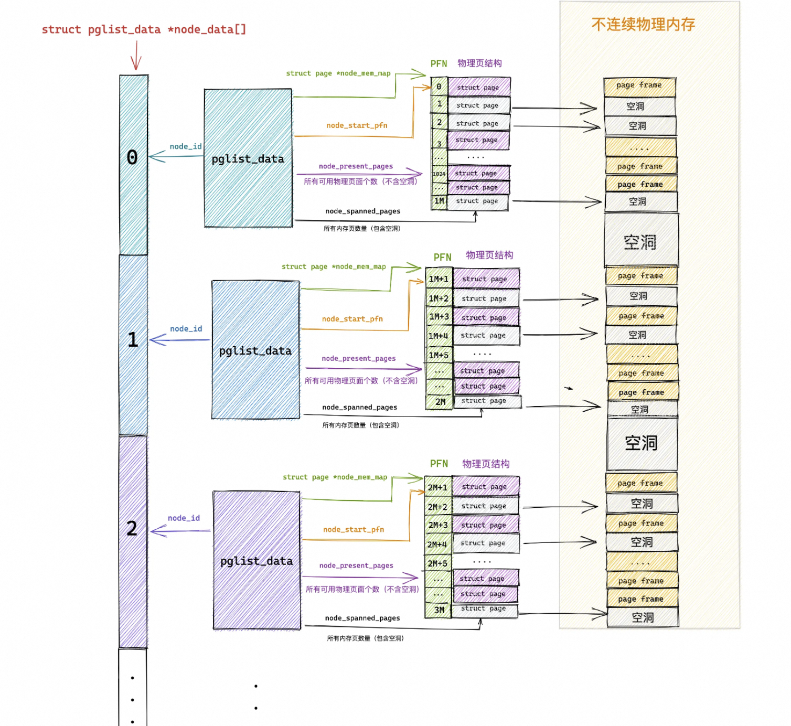

            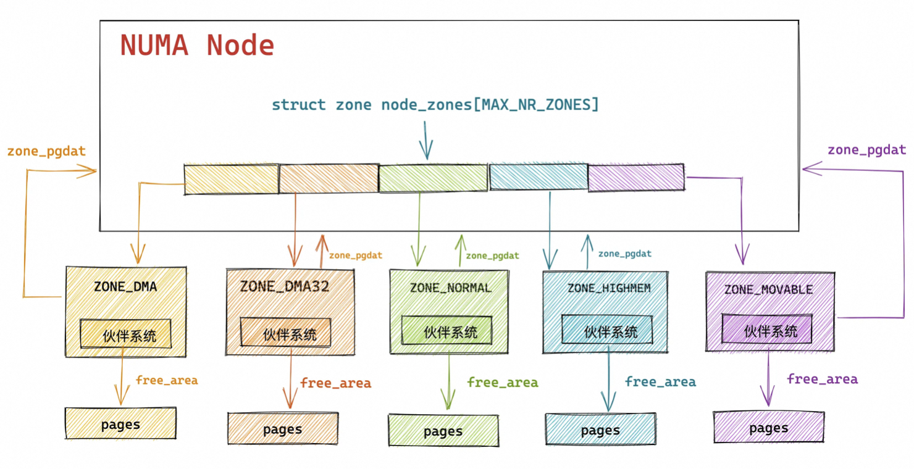

            9. 物理内存区域中的预留内存：每个物理内存区域 struct zone 还为操作系统预留了一部分内存，用于内核的一些核心操作，这些操作无论如何是不允许内存分配失败的。
               1. 适用场景1：进程是不允许阻塞的，内存分配的请求必须马上得到满足，比如执行中断处理程序或者执行持有自旋锁等临界区内的代码时，进程就不允许睡眠，因为中断程序无法被重新调度。这时就需要内核提前为这些核心操作预留一部分内存，当内存紧张时，可以使用这部分预留的内存给这些操作分配，存储在nr_reserved_highatomic 变量中。
               2. 适用场景2：lowmem_reserve 数组则是用于规定每个内存区域必须为自己保留的物理页数量，**防止更高位的内存区域对自己的内存空间进行过多的侵占挤压（即防止高位中的内存（如ZONE_NORMAL）不够用时会拿低位内存（如ZONE_DMA）来使用，低位内存为了避免自己被过多挤压而预留的内存）。**
            10. 物理内存区域中的水位线：**设置swapiness配置的值来调整内存紧张时操作系统更倾向于回收匿名页还是文件页；具体什么时候触发内存/采取什么方式进行内存回收（直接内存回收/后台内存回收/oom）回收取决于三个水位线WMARK_MIN（页最小阈值）， WMARK_LOW （页低阈值），WMARK_HIGH（页高阈值）**。 WMARK_LOW 和WMARK_HIGH是用WMARK_MIN（min_free_kbytes 参数/KB）按照固定倍数计算出的。并且，用户可以通过 `sysctl` 来动态调整 watermark_scale_factor 参数，内核会动态重新计算水位线之间的间距，使得 WMARK_MIN 与 WMARK_LOW 之间留有足够的缓冲余地，使得 kswapd 能够有时间回收足够的内存，**从而解决直接内存回收导致的性能抖动问题**。
            11. 物理内存区域中的冷热页
                1. 热页就是已经加载进 CPU 高速缓存中的物理内存页，所谓的冷页就是还未加载进 CPU 高速缓存中的物理内存页
                2. 物理内存区域 struct zone 包含了一个 struct per_cpu_pageset 类型的数组 pageset。其中内核关于冷热页的管理全部封装在 struct per_cpu_pageset 结构中。因为每个 CPU 都有自己独立的高速缓存，所以每个 CPU 对应一个 per_cpu_pageset 结构，pageset 数组容量 NR_CPUS 是一个可以在编译期间配置的宏常数，表示内核可以支持的最大 CPU个数，在 NUMA 内存架构下，每个物理内存区域都是属于一个特定的 NUMA 节点，NUMA 节点中包含了一个或者多个 CPU，NUMA 节点中的每个内存区域会关联到一个特定的 CPU 上，但 struct zone 结构中的 pageset 数组包含的是系统中所有 CPU 的高速缓存页。因为虽然一个内存区域关联到了 NUMA 节点中的一个特定 CPU 上，但是其他CPU 依然可以访问该内存区域中的物理内存页，因此其他 CPU 上的高速缓存仍然可以包含该内存区域中的物理内存页。
                3. 在 struct per_cpu_pages 结构中，每一种迁移类型都会对应一个冷热页链表。

      5. 内核如何描述物理内存页（struct page）

         1. **Linux 为什么会默认采用 4KB 作为标准物理内存页的大小**：Linux 规定必须是 2 的整数次幂， 2 的整数次幂可以将一些数学运算转换为移位操作，在大多数情况下，内存与磁盘之间传输小块数据时会更加的高效，所以综上所述内核会采用 4KB 作为默认物理内存页大小。

         2. page如何在适应多种场景的前提下保持其中所占内存较小：struct page 结构体里包含了大量的 union 结构，而 union 结构在 C 语言中被用于同一块内存根据不同场景保存不同类型数据的一种方式。**内核之所以在 struct page 结构中使用 union，是因为一个物理内存页面在内核中的使用场景和使用方式是多种多样的。**在这多种场景下，利用 union 尽最大可能使 struct page 的内存占用保持在一个较低的水平。

         3. 内核申请物理内存页面的方式：

            1. 一页一页的分配使用，这种以页（4KB）为单位的分配方式内核会向相应内存区域 zone 里的伙伴系统申请以及释放。
            2. 只分配小块的内存，不需要一下分配一页的内存，比如 struct page ，anon_vma_chain ，anon_vma ，vm_area_struct 结构实例的分配，这些结构通常就是几十个字节大小，并不需要按页来分配。Linux 内核使用 slab allocator 分配器来分配。

         4. struct page 结构在不同场景下的使用方式：

            1. ==匿名页的反向映射==：建立物理内存页 struct page 与进程虚拟内存空间 VMA 之间的映射关系，用于回收物理内存页时断开其与虚拟内存页之间的关联关系

            2. 内存页回收相关属性：高效的页面替换算法SFRA（**LRU算法仅仅考虑时间没有考虑频率而导致页面颠簸**）：

               * 首先 inactive 链表的尾部存放的是访问频率最低并且最少访问的页面，在内存紧张的时候，这些页面被置换出去的优先级是最大的。
               * **对于文件页来说**，当它被第一次读取的时候，内核会将它放置在 inactive 链表的头部，如果它继续被访问，则会提升至 active 链表的尾部。如果它没有继续被访问，则会随着新文件页的进入，内核会将它慢慢的推到 inactive 链表的尾部，如果此时再次被访问则会直接被提升到 active 链表的头部。大家可以看出此时页面的使用频率这个因素已经被考量了进来。
               * **对于匿名页来说**，当它被第一次读取的时候，**内核会直接将它放置在 active 链表的尾部，注意不是 inactive 链表的头部，这里和文件页不同。因为匿名页的换出 Swap Out 成本会更大，内核会对匿名页更加优待**。当匿名页再次被访问的时候就会被被提升到 active 链表的头部。
               * 当遇到内存紧张的情况需要换页时，内核会从 active 链表的尾部开始扫描，将一定量的页面降级到 inactive 链表头部，这样一来原来位于 inactive 链表尾部的页面就会被置换出去。

               并且**把 active 链表和 inactive 链表分成两类，一类是匿名页，一类是文件页**，通过swapiness参数控制更倾向于回收文件页还是匿名页。若不分开，到链表中去查找并删除文件页/匿名页是低效的。

               除了这四种链表外系统中还有一种保存无论如何不会被置换出去的内存页的链表

            3. 物理内存页属性和状态的标志位：struct page的flags 字段的高 8 位用来表示 struct page 的定位信息（section + node + zone，**物理内存在内核中管理的层次是 node -> zone -> page**），剩余低位表示特定的标志位。

            4. 复合页compound_page相关属性：巨型大页就是通过两个或者多个物理上连续的内存页 page 组装成的一个比普通内存页 page 更大的页，在linux内核中采用复合页 compound_page的概念进行管理，首页对应的 struct page 结构里的 flags 会被设置为 PG_head，表示这是复合页的第一页，复合页中的所有尾页都会通过其对应的 struct page 结构中的 compound_head 指向首页，这样通过首页和尾页就组装成了一个完整的复合页 compound_page。

            5. slab对象池相关属性

               1. 作用：满足固定大小的对象需要的小内存分配的需要，Linux 内核使用 slab allocator 分配器来分配，slab 就好比一个对象池，**内核中的数据结构对象都对应于一个 slab 对象池，用于分配这些固定类型对象所需要的内存**。
               2. 基本原理：**从伙伴系统中申请一整页内存，然后划分成多个大小相等的小块内存被 slab 所管理**。 slab 管理的单元是物理内存页 page 内进一步划分出来的小块内存，所以当 page 被分配给相应 slab 结构之后，struct page 里也会存放 slab 相关的一些管理数据。

