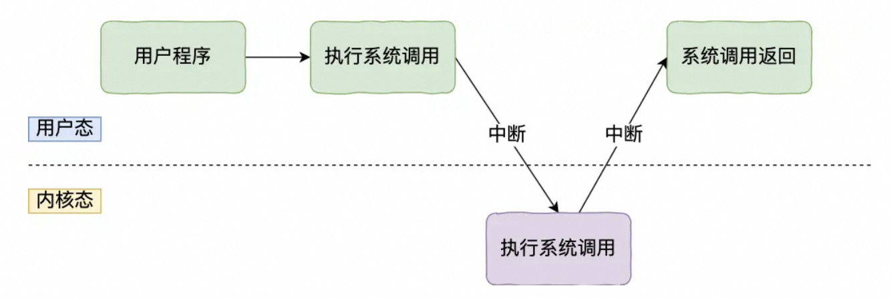

## 内核

1. 内核

   1. 作用：**内核作为应用连接硬件设备的桥梁**，应用程序只需关心与内核交互，不用关心硬件的细节

   2. 功能：

      1. 管理进程、线程，决定哪个进程、线程使用 CPU，也就是**进程调度的能力**；
      2. 管理内存，决定内存的分配和回收，也就是**内存管理的能力**；
      3. 管理硬件设备，为进程与硬件设备之间提供通信能力，也就是**硬件通信能力**；
      4. **提供系统调用**，如果应用程序要运行更高权限运行的服务，那么就需要有系统调用，它是用户程序与操作系统之间的接口。

   3. 工作原理：内核具有很高的权限，可以控制 cpu、内存、硬盘等硬件，而应用程序具有的权限很小，因此大多数操作系统，把内存分成了两个区域：

      - **内核空间**，这个内存空间只有内核程序可以访问；内核空间的代码可以访问所有内存空间，即该程序在**内核态**执行
      - **用户空间**，这个内存空间专门给应用程序使用；用户空间的代码只能访问一个局部的内存空间，即该程序在**用户态**执行

      应用程序如果需要进入内核空间，就需要通过系统调用，过程如下：

      

        
        内核程序执行在内核态，用户程序执行在用户态。当应用程序使用系统调用时，会产生一个中断。发生中断后， CPU 会中断当前在执行的用户程序，转而跳转到中断处理程序，也就是开始执行内核程序。内核处理完后，主动触发中断，把 CPU 执行权限交回给用户程序，回到用户态继续工作。
      

   4. 分类：

      1. 宏内核，包含多个模块，整个内核像一个完整的程序；
      2. 微内核，有一个最小版本的内核，一些模块和服务则由用户态管理；
      3. 混合内核，是宏内核和微内核的结合体，内核中抽象出了微内核的概念，也就是内核中会有一个小型的内核，其他模块就在这个基础上搭建，整个内核是个完整的程序；

2. linux内核

   1. 主要理念：
      1. *MultiTask*，多任务：可以有多个任务同时（并发/并行）执行
      2. *SMP*，对称多处理：每个 CPU 的地位是相等的，对资源的使用权限也是相同的，多个 CPU 共享同一个内存，每个 CPU 都可以访问完整的内存和硬件资源，不会有某个 CPU 单独服务应用程序或内核程序，而是每个程序都可以被分配到任意一个 CPU 上被执行。
      3. *ELF*，可执行文件链接格式：定义Linux 操作系统中可执行文件的存储格式
      4. *Monolithic Kernel*，宏内核：Linux 内核架构就是宏内核，意味着 Linux 的内核是一个完整的可执行程序，且拥有最高的权限。宏内核的特征是系统内核的所有模块，比如进程调度、内存管理、文件系统、设备驱动等，都运行在内核态。

3. windows内核

   1. 与linux的差别：**Window 的内核设计是混合型内核**；Windows 的可执行文件的格式与 Linux 也不同，Windows 的可执行文件格式叫 PE，称为**可移植执行文件**，扩展名通常是`.exe`、`.dll`、`.sys`等

