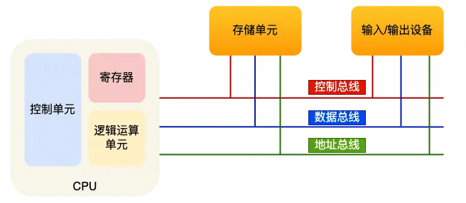
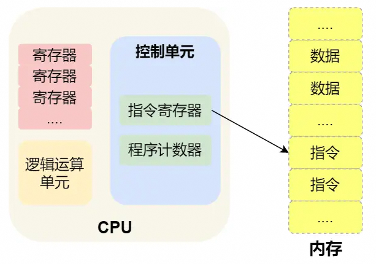
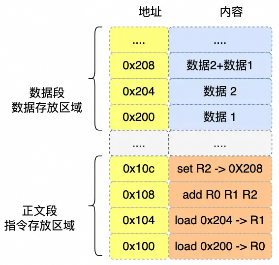
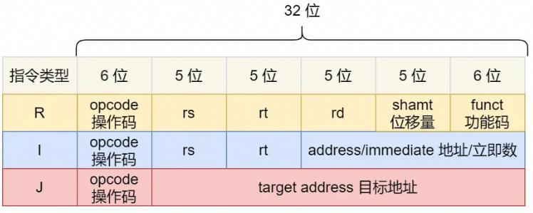
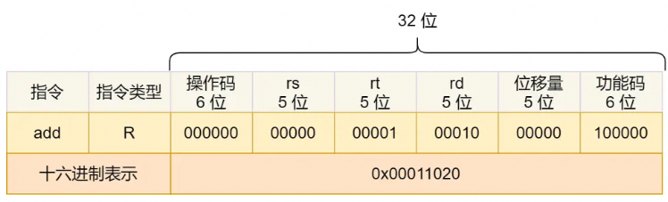
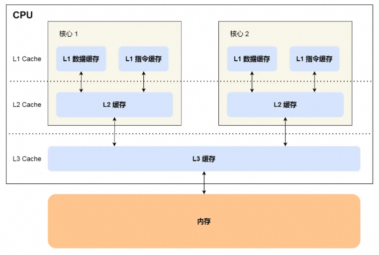
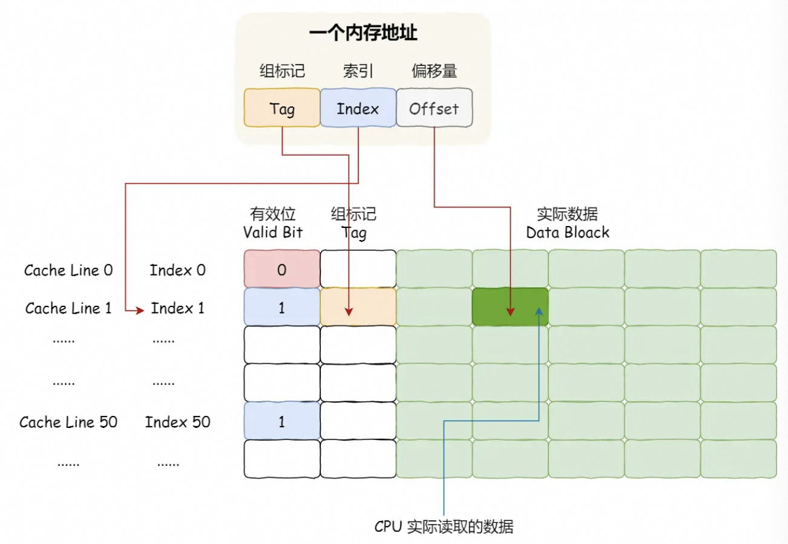
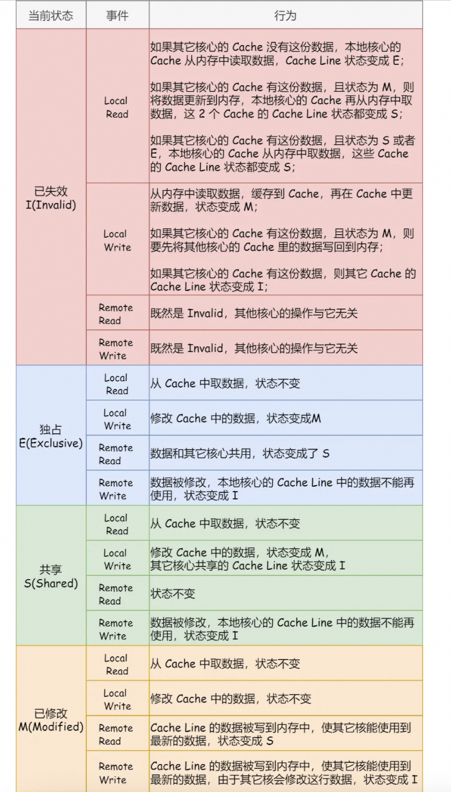
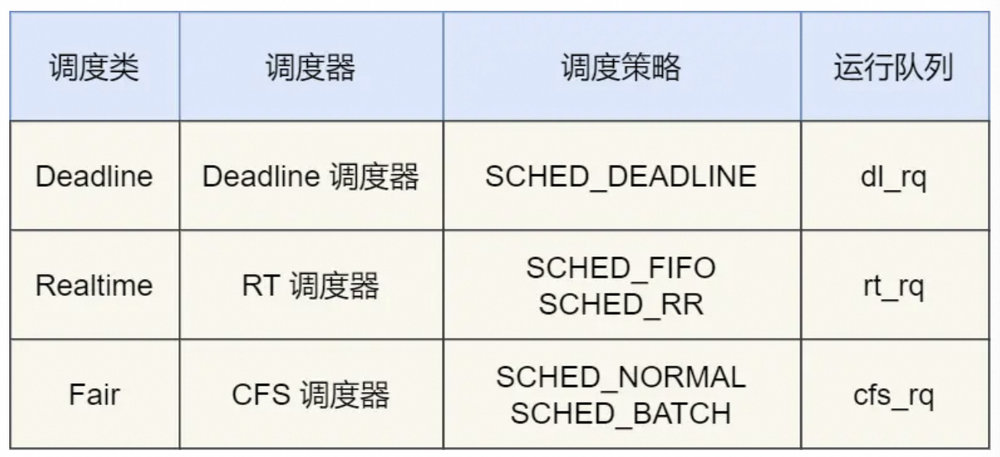

## CPU是如何执行程序的

### 图灵机的工作方式

1. 组成结构：纸带（内存+数据）、读写头（读取字符/写入字符，有存储单元、控制单元、运算单元）。
2. 主要功能：读取纸带格子中的内容，然后交给控制单元识别字符是数字还是运算符指令，如果是数字则存入到图灵机状态中，如果是运算符，则通知运算符单元读取状态中的数值进行计算，计算结果最终返回给读写头，读写头把结果写入到纸带的格子中。

### 冯诺依曼模型

1. 内容：定义计算机基本结构为5个部分， 分别是**运算器（属于中央处理器）、控制器（属于中央处理器）、存储器（内存）、输入设备（如键盘）、输出设备（如显示器）**，这**5个部分被称为冯诺依曼模型**。各个部件之间通过**总线**沟通，关系如下：

   

2. 内存

   1. 作用：存储程序和数据
   2. 基本单位：字节byte，1 byte=8 bit，每一个字节都对应一个内存地址
   3. 结构：内存的地址从0开始编号并自增排列，最后一个地址为内存总子节数-1，在内存中读写任何一个数据的速度都是一样的

3. 中央处理器（**CPU**）

   1. 32 位和 64 位 CPU 最主要区别： **CPU一次能计算/运算的数据量/字节数，即CPU的位宽**（32位置-4字节，64位-8字节）。如此设计的目的是**为了能够计算更大的数值**（如 32 位 CPU 能计算的最大整数是 `4294967295`即为`2^32-1`）， **CPU 位宽越大，可以计算的数值就越大**。但是，并不代表 64 位 CPU 性能比 32 位 CPU 高很多，很少应用需要算超过 32 位的数字，所以**如果计算的数额不超过 32 位数字的情况下，32 位和 64 位 CPU 之间没什么区别的，只有当计算超过 32 位数字的情况下，64 位的优势才能体现出来**。
   2. 内部元件：寄存器（多种，主要作用是存储运算时的数据，提升速度）、控制单元（控制CPU工作）、逻辑运算单元（负责运算）
   3. 常见的寄存器种类：
      1. **通用寄存器**，用来存放需要进行运算的数据，比如需要进行加和运算的两个数据。
      2. **程序计数器**，**用来存储 CPU 要执行下一条指令「所在的内存地址」**，注意不是存储了下一条要执行的指令，此时指令还在内存中，程序计数器只是存储了下一条指令「的地址」。
      3. **指令寄存器**，**用来存放当前正在执行的指令，也就是指令本身**，指令被执行完成之前，指令都存储在这里。

4. 总线

   1. 作用：**用于CPU和内存及其他设备之间的通信**
   2. 分类：
      1. **地址总线**：指定**CPU将要操作的内存地址**
      2. **数据总线**：**读写内存的数据**
      3. **控制总线**：**用于发送和接收信号**，如中断、设备复位等信号，CPU接收信号后进行相应
   3. CPU读写内存数据时的操作：**首先要通过「地址总线」来指定内存的地址；然后通过「控制总线」控制是读或写命令；最后通过「数据总线」来传输数据**。

5. 输入输出设备：输入设备向计算机输入数据，计算机经过计算后，把数据输出给输出设备。期间，如果输入设备是键盘，按下按键时需要和 CPU 进行交互，需要用到控制总线。

### 线路位宽与CPU位宽

1. 线路位宽
   1. 数据如何通过线路传输：**通过线路的电压来操作，低电压表示0，高电压表示1**，一条线路一次只能传输1位的数据，下一个 bit 必须等待上一个 bit 传输完成才能进行传输，即串行，在此基础之上可以**通过增加线路来实现并行，即一次传输多位数据**。**线路的位宽最好一次就能访问到所有的内存地址**。
   2. 线路位宽：例如：CPU通过地址总线来操作内存地址，**若线路位宽是`x`，则可以操作的内存地址的数量最多为`2^x`**，则若CPU想要操作4G的内存，则需要32条内存总线（因此，32 位 CPU 最大只能操作 4GB 内存，即使使用 8 GB 内存条也没有提升）。同理也适用于数据总线等。

2. 线路位宽与CPU位宽的关系
   1. **CPU 的位宽最好不要小于线路位宽**，32 位的 CPU 最好和 32 位宽的线路搭配，因为 32 位 CPU 一次最多只能操作 32 位宽的地址总线和数据总线。（例如：如果用 32 位 CPU 去加和两个 64 位大小的数字，就需要把这 2 个 64 位的数字分成 2 个低位 32 位数字和 2 个高位 32 位数字来计算，先加个两个低位的 32 位数字，算出进位，然后加和两个高位的 32 位数字，最后再加上进位，就能算出结果了，可以发现 32 位 CPU 并不能一次性计算出加和两个 64 位数字的结果。）

### 程序执行的基本过程

1. CPU执行指令的过程（**CPU的指令周期**：读取执行、执行指令、读取下一条指令 ... ）

   1. CPU 读取 **程序计数器** 的值（**指令的内存地址**），然后 CPU 的 **控制单元**操作**地址总线**指定需要访问的内存地址，接着通知**内存设备**准备数据，数据准备好后通过**数据总线**将指令数据传给 CPU，CPU 收到内存传来的数据后，将这个指令数据存入到**指令寄存器**。
   2. **程序计数器的值自增（指向下一条指令）**。自增的大小由 CPU 的位宽决定，比如 32 位的 CPU，指令是 4 个字节，需要 4 个内存地址存放，因此「程序计数器」的值会自增 4。
   3. **CPU 分析指令寄存器中的指令，确定指令的类型和参数**，如果是计算类型的指令，就把指令交给逻辑运算单元运算；如果是存储类型的指令，则交由「控制单元」执行。

   

2. 具体执行过程示例（a = 1 + 2）

   1. 预处理：**程序代码字符串  --> 编译成汇编代码 --> 用汇编器翻译成机器码（0 1组成的机器与语言）/计算机指令**

   2.  `a = 1 + 2` 在 32 位 CPU 的执行过程：

      编译过程：程序编译过程中，编译器通过分析代码，发现 1 和 2 是数据，于是程序运行时，**数据被存放在内存中的数据段中**，编译器会把 `a = 1 + 2` 翻译成 4 条指令，存放到**正文段**中，即**数据和指令是分开区域存放的，存放指令区域的地方称为正文段，存放数据段为数据段**。具体情况如下图所示：

      <div style="overflow: auto;">     编译完成后，具体执行程序的时候，程序计数器会被设置为 0x100 地址，然后依次执行这 4 条指令。上面的例子中，由于是在 32 位 CPU 执行的，因此一条指令是占 32 位大小，所以你会发现每条指令间隔 4 个字节。而数据的大小是根据你在程序中指定的变量类型，比如 int 类型的数据则占 4 个字节，char 类型的数据则占 1 个字节，是不固定的。 <div>注意：右侧是极简的汇编代码。</div></div> 

### 指令

1. 机器码

   1. 作用：**每一条指令都有对应的二进制机器码，CPU通过解析机器码来知道指令的内容**，即编译器编译程序时会构造指令进行指令的编码，CPU执行程序时解析指令进行指令的解码。
   2. 指令集：不同的CPU有不同的指令集，对应不同的汇编语言和机器码，常见的有**MIPS指令集**

2. MIPS指令集

   1. 指令格式： **32 位的整数，高 6 位代表着操作码**，表示这条指令是一条什么样的指令，剩下的 26 位不同指令类型所表示的内容也就不相同，**主要有三种类型R、I 和 J**。

   2. 指令含义：

      1. R 指令：用在**算术和逻辑操作**，里面有**读取和写入数据的寄存器地址**。**如果是逻辑位移操作，后面还有位移操作的位移量，而最后的功能码则是再前面的操作码不够的时候，扩展操作码来表示对应的具体指令的**。
      2. I 指令：用在**数据传输、条件分支**等。这个类型的指令，就没有了位移量和功能码，也没有了第三个寄存器，而是把这三部分直接合并成了**一个地址值或一个常数**。
      3. J 指令：用在**跳转**，高 6 位之外的 **26 位都是一个跳转后的地址**。

      <div style="overflow: auto;">
      </div>

   3. 指令的类型（5类）

      1. **数据传输类型的指令**，比如 `store/load` 是寄存器与内存间数据传输的指令，`mov` 是将一个内存地址的数据移动到另一个内存地址的指令；
      2. **运算类型的指令**，比如加减乘除、位运算、比较大小等等，它们最多只能处理两个寄存器中的数据；
      3. **跳转类型的指令**，通过修改程序计数器的值来达到跳转执行指令的过程，比如编程中常见的 `if-else`、`switch-case`、函数调用等。
      4. **信号类型的指令**，比如发生中断的指令 `trap`；
      5. **闲置类型的指令**，比如指令 `nop`，执行后 CPU 会空转一个周期；

   4. 指令的执行速度

      1. CPU的时钟周期：**每一次脉冲信号高低电平的转换就是一个周期，称为时钟周期**。对于 CPU 来说，在一个时钟周期内，CPU 仅能完成一个最基本的动作，时钟频率越高，时钟周期就越短，工作速度也就越快。CPU 的硬件参数 `GHz` 为1 指的是时钟频率/主频是 1 G，代表着 1 秒会产生 1G 次数的脉冲信号。**大多数一条指令不能在一个时钟周期完成**。

      2. 程序的CPU执行时间 = **CPU时钟周期数** * **时钟周期时间**（即 1/xGHz，取决于硬件）

         CPU时钟周期数 = **指令数**（执行程序需要多少条指令，编译层的优化） * **每条指令的平均时钟周期数**（CPI，一条指令需要多少个时钟周期）

         提升程序运行时间，一般从以上三个角度入手。

3. CPU流水线
   1. 4级流水线：CPU将一条指令的执行拆分成4个小任务并进行流水线执行，这四个阶段即为指令周期，CPU的工作就是一个周期接着一个周期
      1. CPU 通过程序计数器读取对应内存地址的指令，这个部分称为 **Fetch（取得指令）**；
      2. CPU 对指令进行解码，这个部分称为 **Decode（指令译码）**；
      3. CPU 执行指令，这个部分称为 **Execution（执行指令）**；
      4. CPU 将计算结果存回寄存器或者将寄存器的值存入内存，这个部分称为 **Store（数据回写）**；
   2. 流水线对应计算机组件
      1. 取指令的阶段，我们的指令是存放在**存储器**里的，实际上，通过程序计数器和指令寄存器取出指令的过程，是由**控制器**操作的；
      2. 指令的译码过程，也是由**控制器**进行的，**指令译码控制器将指令解析成不同的操作信号和地址、操作数**，并通过电路将指令和数据传输到算数逻辑单元；
      3. 指令执行的过程，无论是进行算术操作、逻辑操作，还是进行数据传输、条件分支操作，都是由**算术逻辑单元**操作的，也就是由**运算器**处理的。但是如果是一个简单的无条件地址跳转，则是直接在**控制器**里面完成的，不需要用到运算器。
      4. 将数据操作解惑写回内存

### 相关问题

1. 64 位相比 32 位 CPU 的优势在哪吗？64 位 CPU 的计算性能一定比 32 位 CPU 高很多吗？

   64 位相比 32 位 CPU 的优势主要体现在两个方面：（1）64 位 CPU 可以一次计算超过 32 位的数字，而 32 位 CPU 如果要计算超过 32 位的数字，要分多步骤进行计算，效率就没那么高，但是大部分应用程序很少会计算那么大的数字，所以**只有运算大数字的时候，64 位 CPU 的优势才能体现出来，否则和 32 位 CPU 的计算性能相差不大**。（2）**通常来说 64 位 CPU 的地址总线是 48 位**（不是64位总线的原因是，这个大小远超实际使用的物理地址大小），而 32 位 CPU 的地址总线是 32 位，所以 64 位 CPU 可以**寻址更大的物理内存空间**。如果一个 32 位 CPU 的地址总线是 32 位，那么该 CPU 最大寻址能力是 4G，即使你加了 8G 大小的物理内存，也还是只能寻址到 4G 大小的地址，而如果一个 64 位 CPU 的地址总线是 48 位，那么该 CPU 最大寻址能力是 `2^48`，远超于 32 位 CPU 最大寻址能力。

2. 软件的 32 位和 64 位之间的区别吗？再来 32 位的操作系统可以运行在 64 位的电脑上吗？64 位的操作系统可以运行在 32 位的电脑上吗？如果不行，原因是什么？

   64 位和 32 位软件，实际上代表**指令是 64 位还是 32 位的**：如果 32 位指令在 64 位机器上执行，需要一套兼容机制，就可以做到兼容运行了。但是**如果 64 位指令在 32 位机器上执行，就比较困难了，因为 32 位的寄存器存不下 64 位的指令**；操作系统其实也是一种程序，我们也会看到操作系统会分成 32 位操作系统、64 位操作系统，其代表意义就是操作系统中程序的指令是多少位，比如 64 位操作系统，指令也就是 64 位，因此不能装在 32 位机器上。总之，**硬件的 64 位和 32 位指的是 CPU 的位宽，软件的 64 位和 32 位指的是指令的位宽。**


## 存储器的层次结构与关系

1. 存储器的层次结构：越快、能耗越大、越贵、容量越小

   1. **寄存器**：**CPU中的控制单元和逻辑运算单元的存储器就是寄存器**，**数量在几十到几百之间**，每个寄存器都可以存储一定都字节（**32位CPU中大部分寄存器可以存储4字节，64位的为8字节**），寄存器的访问速度非常快，**一般为半个CPU周期**。

   2. **CPU cache/高速缓存**：使用的是**SRAM（静态随机存储器）的芯片，通电后数据可以保持，断电数据则丢失**。在 SRAM 里面，一个 bit 的数据，通常需要 6 个晶体管，所以 SRAM 的存储密度不高，同样的物理空间下，能存储的数据是有限的，不过也因为 SRAM 的电路简单，所以访问速度非常快。**CPU 的高速缓存通常可以分为 L1、L2、L3 这样的三层高速缓存**。结构如下：

      <div style="overflow: auto;">
        L1 高速缓存的访问速度几乎和寄存器一样快，通常<b>只需要 2~4 个时钟周期，而大小在几十 KB 到几百 KB 不等</b>。<b>每个 CPU 核心都有一块属于自己的 L1 高速缓存</b>，<b>指令和数据在 L1 是分开存放的，所以 L1 高速缓存通常分成指令缓存和数据缓存</b>。L2 高速缓存同样每个 CPU 核心都有，但是 L2 高速缓存位置比 L1 高速缓存距离 CPU 核心 更远，它大小比 L1 高速缓存更大，CPU 型号不同大小也就不同，通常<b>大小在几百 KB 到几 MB 不等，访问速度则更慢，速度在 10~20 个时钟周期</b>。L3 高速缓存<b>通常是多个 CPU 核心共用的</b>，位置比 L2 高速缓存距离 CPU 核心 更远，大小也会更大些，<b>通常大小在几 MB 到几十 MB 不等，具体值根据 CPU 型号而定。访问速度相对也比较慢一些，访问速度在 20~60个时钟周期。内存的速度在200-300个周期。</b>
      </div>

   3. **内存**：使用的是**DRAM（动态随机存储器）**的芯片，相比 SRAM，DRAM 的密度更高，功耗更低，有更大的容量，更便宜。DRAM 存储一个 bit 数据，只需要一个晶体管和一个电容就能存储，但是**因为数据会被存储在电容里，电容会不断漏电，所以需要「定时刷新」电容，才能保证数据不会被丢失**。内存速度大概在 `200~300` 个 时钟周期之间。

   4. **SSD/HDD硬盘**：**SSD（固体硬盘）结构和内存类似**，但是它相比内存的优点是断电后数据还是存在的，而内存、寄存器、高速缓存断电后数据都会丢失。内存的读写速度比 SSD 大概快 `10~1000` 倍。**HDD（机械硬盘）是通过物理读写的方式来访问数据的**，因此它访问速度是非常慢的，它的速度比内存慢 `10W` 倍左右。

   5. 存储器的层次关系（**金字塔图**）

   6. 访问关系：**CPU 并不会直接读写每一种存储器设备，而是每一种存储器设备只读写和它相邻的存储器设备。**

   7. 存储器层次结构中的缓存体系：当 CPU 需要访问内存中某个数据的时候，如果寄存器有这个数据，CPU 就直接从寄存器取数据即可，如果寄存器没有这个数据，CPU 就会查询 L1 高速缓存，如果 L1 没有，则查询 L2 高速缓存，L2 还是没有的话就查询 L3 高速缓存，L3 依然没有的话，才去内存中取数据。


## CPU cache

1. 高速缓存

   1. 目的：弥补寄存器和内存在读取数据的速度和数据量上的巨大差异。

   2. 容量：L1的数据缓存和质量缓存均为32K，L2是256K，L3是3MB，原因是L3是多个CPU共享的，L1 L2则是独有的。

   3. 访问关系：程序执行时，会先将内存中的数据加载到共享的 L3 Cache 中，再加载到每个核心独有的 L2 Cache，最后进入到最快的 L1 Cache，之后才会被 CPU 读取。

   4. 数据结构：CPU Cache 是由很多个 **Cache Line（缓存块）** 组成的，**Cache Line 是 CPU 从内存读取数据的基本单位，而Cache Line 是由各种标志【Tag：组标记（标记内存块的位置）、有效位（标记缓存块是否有效，为0则无论是否有数据均从内存中重新加载）等】+ 数据块（Data Block）组成**，一般是64个字节，取决于`coherency_line_size` 的值，即会从内存中一下子读取一整固定大小的数据（**根据内存块的地址从内存中读取数据**）到缓存中，即使超出了想要读取的单个数据的大小（**顺序加载**），目的是通过命中缓存的方式方便后续的查找。

   5. 读取过程：如何判断需要访问的内存数据是否在缓存中及如何找到数据？

      1. **直接映射缓存（directed mapped cache）**：**把内存块的地址始终映射在一个 CPU Cache Line（缓存块） 的地址**，映射关系实现方式使用 **取模运算**，取模运算的结果就是内存块地址对应的 CPU Cache Line（缓存块） 的地址，并且采用**组标记**的方式来区分不同的内存块（因为简单取模会使得多个内存块映射到同一个位置的缓存块中）。例如：举个例子，内存共被划分为 32 个内存块，CPU Cache 共有 8 个 CPU Cache Line，假设 CPU 想要访问第 15 号内存块，如果 15 号内存块中的数据已经缓存在 CPU Cache Line 中的话，则是一定映射在 7 号 CPU Cache Line 中，因为 `15 % 8` 的值是 7。（其他的映射方式还有 全相连 Cache （*Fully Associative Cache*）、组相连 Cache （*Set Associative Cache*））

      2. 利用**偏移量**从缓存中读取数据：CPU从高速缓存中读取的是一个数据片段/字，需要通过偏移量来定位。（内存地址还是唯一对应某一个字节的，只是在高速缓存中采用当前这种地址拆解和映射方式来将大块的内存映射到小块的缓存中）

         * **一个内存地址 = 组标记 + 索引 + 偏移量** --> **地址分解**
         * 一个cache line = 索引 + 有效位 + 组标记 + 数据块

         若一个内存中的数据已经存在于缓存中，则CPU访问内存地址时会经历以下四步：

         * 根据内存地址中索引信息，计算在 CPU Cache 中的索引，也就是找出对应的 CPU Cache Line 的地址；
         * 找到对应 CPU Cache Line 后，判断 CPU Cache Line 中的有效位，确认 CPU Cache Line 中数据是否是有效的，如果是无效的，CPU 就会直接访问内存，并重新加载数据，如果数据有效，则往下执行；
         * 对比内存地址中组标记和 CPU Cache Line 中的组标记，确认 CPU Cache Line 中的数据是我们要访问的内存数据，如果不是的话，CPU 就会直接访问内存，并重新加载数据，如果是的话，则往下执行；
         * 根据内存地址中偏移量信息，从 CPU Cache Line 的数据块中，读取对应的字。

         

         例如：==CPU需要访问内存中地址为0x12345678的数据，Cache的组大小为64字节，那么由于cache line的大小是64字节，则对应从内存中加载到缓存中的块大小就是64字节，对应于地址的后6位（即0x78=01111000）并且由于块大小是64字节因此块的起点应该是64的倍数，当前的具体字节的偏移量即为与起点的差值。索引取决于cache中的组数==

   2. 如何提升缓存命中率
      1. 数据缓存命中率：**例如遍历数组时，按照内存布局顺序访问，将可以有效的利用 CPU Cache，提升代码性能** 
      2. 指令缓存命中率：
         1. CPU分支预测器：对于 if 条件语句，意味着此时至少可以选择跳转到两段不同的指令执行，也就是 if 还是 else 中的指令。那么，**如果分支预测可以预测到接下来要执行 if 里的指令，还是 else 指令的话，就可以「提前」把这些指令放在指令缓存中，这样 CPU 可以直接从 Cache 读取到指令，于是执行速度就会很快**。
         2. 方法：尽可能使得分支预测器可以有效预测分支，比如将数组先排序再操作会比将数字先操作再排序效果更好。
      3. 多核CPU缓存命中率：现代 CPU 都是多核心的，线程可能在不同 CPU 核心来回切换执行，这对 CPU Cache 不是有利的，虽然 L3 Cache 是多核心之间共享的，但是 L1 和 L2 Cache 都是每个核心独有的，**如果一个线程在不同核心来回切换，各个核心的缓存命中率就会受到影响**，相反如果线程都在同一个核心上执行，那么其数据的 L1 和 L2 Cache 的缓存命中率可以得到有效提高，缓存命中率高就意味着 CPU 可以减少访问 内存的频率。当有多个同时执行「计算密集型」的线程，为了防止因为切换到不同的核心，而导致缓存命中率下降的问题，我们可以把**线程绑定在某一个 CPU 核心上**，在 Linux 上提供了 `sched_setaffinity` 方法，来实现将线程绑定到某个 CPU 核心这一功能。


## CPU 缓存一致性

### CPU cache的数据写入

1. CPU cache的写回

   1. 目的：CPU cache中的数据不光有读操作还有写操作，数据写入 cache 之后，内存与 cache 相对应的数据将会不同，则需要把cache中的数据写回到内存中来保持一致。

   2. 策略：

      1. 写直达write through：**把数据同时写入内存和cache中**；在这个方法里，写入前会先判断数据是否已经在 CPU Cache 里面了：

         - 如果数据已经在 Cache 里面，先将数据更新到 Cache 里面，再写入到内存里面；
         - 如果数据没有在 Cache 里面，就直接把数据更新到内存里面。

         此方法最大的问题在于无论数据在不在 Cache 里面，每次写操作都会写回到内存，这样写操作将会花费大量的时间，影响性能

      2. 写回write back：**当发生写操作时，新的数据仅仅被写入 Cache Block 里，只有当修改过的 Cache Block「被替换」时才需要写到内存中**：

         * 如果当发生写操作时，数据已经在 CPU Cache 里的话，则把数据更新到 CPU Cache 里，同时**标记 CPU Cache 里的这个 Cache Block 为脏（Dirty）的**，表示 CPU Cache 里面的这个 Cache Block 的数据和内存是不一致的，此时并不把数据写到内存里

         * 如果当发生写操作时，**数据不在 CPU Cache 里，并且数据所对应的 Cache Block 里存放的是别的内存地址的数据的话，就要检查这个 Cache Block 里的数据有没有被标记为脏的**：

           - 如果是脏的，把这个 Cache Block 里的数据写回到内存，然后再把当前要写入的数据，**先从内存读入到 Cache Block 里**==（注意，这一步不是没用的）==，然后再把当前要写入的数据写入到 Cache Block，最后也把它标记为脏的；

           - 如果不是脏的话，**把当前要写入的数据先从内存读入到 Cache Block 里**，接着将数据写入到这个 Cache Block 里，然后再把这个 Cache Block 标记为脏的。

             

## 缓存一致性问题

1. 缓存一致性问题

   1. 原因：现在 CPU 都是多核的，由于 L1/L2 Cache 是多个核心各自独有的，那么会带来多核心的**缓存一致性（Cache Coherence）** 的问题，如果不能保证缓存一致性的问题，就可能造成结果错误。
   2. 解决方案：同步多个不同核心里面的缓存数据
      * **写传播Write Propagation**：某个 CPU 核心里的 Cache 数据更新时，必须要传播到其他核心的 Cache。--> **总线嗅探**
      * **事务的串行化Transaction Serialization**：某个 CPU 核心里对数据的操作顺序，必须在其他核心看起来顺序是一样的，则必有 **（1）CPU 核心对于 Cache 中数据的操作，需要同步给其他 CPU 核心；（2）要引入「锁」的概念，如果两个 CPU 核心里有相同数据的 Cache，那么对于这个 Cache 数据的更新，只有拿到了「锁」，才能进行对应的数据更新**。

2. 总线嗅探

   1. 作用：当某个 CPU 核心更新了 Cache 中的数据时通过总线把该事件广播通知到其他核心，其他的CPU核心均监听总线上的广播事件并检查是否拥有相同的数据在L1 cache中，若有则同步更新
   2. 缺点：加重总线负载、未能实现事务的串行化

3. **MESI协议**（*Modified*、*Exclusive*、*Shared*、*Invalidated*）

   1. 作用：基于总线嗅探机制实现事务的串行化，实现CPU缓存一致性

   2. 内容：

      * ***Modified***：已修改，缓存块上的数据被修改过但是还没有更新到缓存
      * ***Exclusive***：独占，**缓存块上的数据没有被更改过并与内存一致，并且只有一个CPU缓存中含有此数据，则并不存在缓存一致性，此CPU可以自由得更改此缓存并且不需要通知其他CPU核心。**然而，处于此状态下的数据一旦被其他CPU从内存中读取了相同的数据到缓存，则变为共享状态。
      * ***Shared***：共享，**缓存块上的数据没有被更改过并与内存一致，并且有多个CPU核心的缓存中均有此数据，则修改数据时不能直接修改，而是要向所有的其他 CPU 核心广播一个请求，要求先把其他核心的 Cache 中对应的 Cache Line 标记为「无效」状态，然后再更新当前 Cache 里面的数据**。
      * ***Invalidated***：已失效，缓存块上的数据已经失效了不可以读取

      举例：

      1. 当 A 号 CPU 核心从内存读取变量 i 的值，数据被缓存在 A 号 CPU 核心自己的 Cache 里面，此时其他 CPU 核心的 Cache 没有缓存该数据，于是标记 Cache Line 状态为「独占」，此时其 Cache 中的数据与内存是一致的；
      2. **然后 B 号 CPU 核心也从内存读取了变量 i 的值，此时会发送消息给其他 CPU 核心，由于 A 号 CPU 核心已经缓存了该数据，所以会把数据返回给 B 号 CPU 核心。**在这个时候， A 和 B 核心缓存了相同的数据，Cache Line 的状态就会变成「共享」，**并且其 Cache 中的数据与内存也是一致的**；
      3. 当 A 号 CPU 核心要修改 Cache 中 i 变量的值，**发现数据对应的 Cache Line 的状态是共享状态，则要向所有的其他 CPU 核心广播一个请求，要求先把其他核心的 Cache 中对应的 Cache Line 标记为「无效」状态，然后 A 号 CPU 核心才更新 Cache 里面的数据，同时标记 Cache Line 为「已修改」（dirty）状态，此时 Cache 中的数据就与内存不一致了**。
      4. **如果 A 号 CPU 核心「继续」修改 Cache 中 i 变量的值，由于此时的 Cache Line 是「已修改」状态，因此不需要给其他 CPU 核心发送消息，直接更新数据即可**。
      5. 如果 A 号 CPU 核心的 Cache 里的 i 变量对应的 Cache Line 要被「替换」，**发现 Cache Line 状态是「已修改」状态，就会在替换前先把数据同步到内存**。

<div style="overflow: auto;">
举例：
1. 当 A 号 CPU 核心从内存读取变量 i 的值，数据被缓存在 A 号 CPU 核心自己的 Cache 里面，此时其他 CPU 核心的 Cache 没有缓存该数据，于是标记 Cache Line 状态为「独占」，此时其 Cache 中的数据与内存是一致的；
2. 然后 B 号 CPU 核心也从内存读取了变量 i 的值，此时会发送消息给其他 CPU 核心，由于 A 号 CPU 核心已经缓存了该数据，所以会把数据返回给 B 号 CPU 核心。在这个时候， A 和 B 核心缓存了相同的数据，Cache Line 的状态就会变成「共享」，并且其 Cache 中的数据与内存也是一致的；
3. 当 A 号 CPU 核心要修改 Cache 中 i 变量的值，发现数据对应的 Cache Line 的状态是共享状态，则要向所有的其他 CPU 核心广播一个请求，要求先把其他核心的 Cache 中对应的 Cache Line 标记为「无效」状态，然后 A 号 CPU 核心才更新 Cache 里面的数据，同时标记 Cache Line 为「已修改」（dirty）状态，此时 Cache 中的数据就与内存不一致了。
4. 如果 A 号 CPU 核心「继续」修改 Cache 中 i 变量的值，由于此时的 Cache Line 是「已修改」状态，因此不需要给其他 CPU 核心发送消息，直接更新数据即可。
5. 如果 A 号 CPU 核心的 Cache 里的 i 变量对应的 Cache Line 要被「替换」，发现 Cache Line 状态是「已修改」状态，就会在替换前先把数据同步到内存。
</div>


## CPU如何执行任务

### CPU如何读写数据

1. 一个CPU中通常有多个CPU核心，每个 CPU 核心都有自己的 L1 Cache 和 L2 Cache，而 L1 Cache 通常分为 dCache（数据缓存） 和 iCache（指令缓存），L3 Cache 则是多个核心共享的，是 CPU 典型的缓存层次。除此之外的存储结构还有内存和硬盘，这些存储设备构成了金字塔存储层次。CPU 从内存中读取数据到 Cache 的时候，并不是一个字节一个字节读取，而是一块一块的方式来读取数据的，这一块一块的数据被称为 CPU Cache Line（缓存块），所以 **CPU Cache Line 是 CPU 从内存读取数据到 Cache 的单位（CPU读写数据的基本单位）**。

2. CPU伪共享问题

   1. 产生原因：**多个线程同时读写同一个 Cache Line 的不同变量时**，而**导致 CPU Cache 失效的现象**，即每一个线程在读写当前cache line时，都需要将其他核心已经修改过的cache line写会内存并且再从内存中读取，使得缓存失效。

   2. 避免方法：**对于多个线程共享的热点数据，即经常会修改的数据，应该避免这些数据刚好在同一个 Cache Line 中**，否则就会出现为伪共享的问题。

      * 在 Linux 内核中存在 `__cacheline_aligned_in_smp` 宏定义将某个变量的地址设置成 Cache Line 对齐地址，即使得两个可能存在于同一个cache line中且会被频繁调用的变量变成处于两个cache line的首部位置，是用空间换时间的做法。

        ```c++
        struct test{
          int a;
          int b __cacheline_aligned_in_smp;
        }
        ```

      * 一个应用层面的规避方案：==有一个 Java 并发框架 Disruptor 使用「字节填充 + 继承」的方式，来避免伪共享的问题==。

### CPU如何选择线程

1. 进程与线程

   1. 区别与联系：在 Linux 内核中，进程和线程都是用 `task_struct` 结构体表示的，区别在于**线程的 task_struct 结构体里部分资源是共享了进程已创建的资源**，比如内存地址空间、代码段、文件描述符等，所以 Linux 中的线程也被称为轻量级进程，因为线程的 task_struct 相比进程的 task_struct 承载的 资源比较少。**一般来说，没有创建线程的进程，是只有单个执行流，它被称为是主线程。如果想让进程处理更多的事情，可以创建多个线程分别去处理，**但不管怎么样，它们对应到内核里都是 `task_struct`，统称为 任务。
   2. 任务分类：根据任务的优先级以及响应要求分类，优先级的数值越小，优先级越高
      1. 普通任务：响应时间没有很高的要求，优先级在 `100~139` 范围内
      2. 实时任务：对系统的响应时间要求很高，也就是要尽可能快的执行实时任务，优先级在 `0~99` 范围内

2. 调度类

   1. 作用：由于任务有优先级之分，Linux 系统为了保障高优先级的任务能够尽可能早的被执行，对调度类的种类进行区分

   2. 分类：

      

      1. Deadline 、 Realtime 都是应用于实时任务的，调度策略合起来共有三种：
         * *SCHED_DEADLINE*：**是按照 deadline 进行调度的，距离当前时间点最近的 deadline 的任务会被优先调度；**
         * *SCHED_FIFO*：对于**相同优先级的任务，按先来先服务的原则，但是优先级更高的任务，可以抢占低优先级的任务，也就是优先级高的可以「插队」**；
         * *SCHED_RR*：对于**相同优先级的任务，轮流着运行，每个任务都有一定的时间片，当用完时间片的任务会被放到队列尾部，以保证相同优先级任务的公平性，但是高优先级的任务依然可以抢占低优先级的任务**；
      2. Fair 是应用于普通任务，都是由 CFS 调度器管理的，分为两种调度策略：
         * *SCHED_NORMAL*：普通任务使用的调度策略；
         * *SCHED_BATCH*：**后台任务的调度策略，不和终端进行交互，因此在不影响其他需要交互的任务，可以适当降低它的优先级**。

   3. 完全公平调度

      1. 作用：对于普通任务而言的基于CFS的完全公平的调度算法
      2. 原理：目标是让分配给每个任务的 CPU 时间是一样，于是其为每个任务安排一个虚拟运行时间 vruntime，如果一个任务在运行，其运行的越久，该任务的 vruntime 自然就会越大，而没有被运行的任务，vruntime 是不会变化的。**在 CFS 算法调度的时候，会优先选择 vruntime 少的任务**，以保证每个任务的公平性。**在此基础之上考虑普通任务的优先级，即为每个任务赋予一个权重值/nice值**。
         * $虚拟运行时间vruntime += 实际运行时间delta-exec * NICE-0-LOAD（权重）$

3. CPU运行队列 runtime queue/rq

   1. 每个 CPU 都有自己的运行队列，用于描述在此 CPU 上所运行的所有进程，其队列包含三个运行队列，**Deadline 运行队列 dl_rq、实时任务运行队列 rt_rq 和 CFS 运行队列 cfs_rq**，其中 **cfs_rq 是用红黑树来描述的，按 vruntime 大小来排序的，最左侧的叶子节点，就是下次会被调度的任务**。

   2. 运行队列优先级：**Deadline > Realtime > Fair**，即Linux 选择下一个任务执行的时候，会按照此优先级顺序进行选择，也就是说先从 `dl_rq` 里选择任务，然后从 `rt_rq` 里选择任务，最后从 `cfs_rq` 里选择任务。因此，**实时任务总是会比普通任务优先被执行**。

   3. 调整优先级：如果**让某个普通任务有更多的执行时间**，可以调整任务的 `nice` 值，从而让优先级高一些的任务执行更多时间。nice 的值能设置的范围是 `-20～19`， **值越低，表明优先级越高，因此 -20 是最高优先级，19 则是最低优先级，默认优先级是 0**。nice 值并不是表示优先级，而是表示优先级的修正数值，priority(new) = priority(old) + nice。

      ```java
      $ nice -n -3 /user/sbin/mysql //在启动时制定优先级
      $ renice -10 -p <进程pid>  //重设优先级
      $ chrt -f 1 -p 1996  //修改调度策略为SCHED_FIFO,并且优先级为1
      ```


## 中断与软中断

1. 中断：
   1. 定义：中断是系统用来响应硬件设备请求的一种**异步事件处理机制**，操作系统收到硬件的中断请求，会打断正在执行的进程，然后调用内核中的中断处理程序来响应请求，中断处理程序，要尽可能快的执行完来减少对正常进程运行调度地影响。并且，**中断处理程序在响应中断时，可能还会「临时关闭中断」**，这意味着，如果当前中断处理程序没有执行完之前，系统中其他的中断请求都无法被响应，也就说中断有可能会丢失。
   2. 问题： **中断处理程序执行过长和中断丢失**
   3. 解决：将中断过程分为两阶段
      1. **硬中断：快速处理中断**：一般会**暂时关闭中断请求，主要负责处理跟硬件紧密相关或者时间敏感的事情**，特点是**快速执行**。
      2. **软中断：延迟处理上半部分未完成的工作**：一般以**「内核线程」**的方式运行，特点是**延迟执行/异步执行**。
2. 软中断
   1. 是以内核线程的方式执行，并且**每一个 CPU 都对应一个软中断内核线程**，名字通常为「ksoftirqd/CPU 编号」，比如 0 号 CPU 对应的软中断内核线程是 `ksoftirqd/0`。软中断不只是包括硬件设备中断处理程序的下半部，**一些内核自定义事件也属于软中断，比如内核调度等、RCU 锁（内核里常用的一种锁）**等。
   2. 常见的系统软中断（可以通过查看 `/proc/softirqs` 的 内容来知晓「软中断」的运行情况，以及 `/proc/interrupts` 的 内容来知晓「硬中断」的运行情况）：**`NET_RX` 表示网络接收中断，`NET_TX`表示网络发送中断、`TIMER` 表示定时中断、`RCU` 表示 RCU 锁中断、`SCHED` 表示内核调度中断**；**同一种中断在不同 CPU 上的累计次数相差不多**；系统的**中断次数的变化速率**是关注重点。
   3. 如何定位软中断CPU使用率过高：top指令查看cpu在软中断上的使用率


## 计算机与二进制表示

1. 为什么负数要用补码表示
   1. 表示方法：int是32位，最高位是符号位，剩余31位表示二进制数据，正数的二进制表示即为十进制转成二进制，负数在计算机中以补码表示（**符号位为1，剩余的为正数的二进制位取反再加一**）
   2. 原因：补码表示使得**对于负数的加减法操作，是和正数加减法操作一样的**

2. 十进制小数与二进制的转换
   1. 表示方法：**乘 2 取整法**，将十进制中的小数部分乘以 2 的整数部分作为二进制的一位，然后继续取小数部分乘以 2 作为下一位，直到不存在小数为止（例如：0.625的二进制表示就是0.101即0.625=2^(-1) + 2^(-2) + 2^(-3)）
   2. 精度缺失：但是并不是所有的小数都可以用二进制进行表示（例如：0.1），得到的结果是无限循环的表示。因此，**由于计算机的资源是有限的，对于没办法用二进制精确的表示的小树，只能用「近似值」来表示，就是在有限的精度情况下，最大化接近目标 的二进制数，但是会造成精度缺失的情况**。（0.1 + 0.2 != 0.3 ）
3. 计算机中如何存储小数
   1. 浮点数：符号位+指数位+尾数（例如：`1000.101`=  `1.000101 x 2^3`，注意小数点左侧只有一位，且只能为1）
   2. 分类：用 `32` 位来表示的浮点数，则称为**单精度浮点数**（指数位8位，尾数位23位），也就是 `float` 变量，而用 `64` 位来表示的浮点数，称为**双精度浮点数**（指数位11位，尾数位52位），也就是 `double` 变量。根据计算，double 的有效数字是 `15~16` 位，float 的有效数字是 `7~8` 位，这些有效位是包含整数部分和小数部分。
   3. 转换：例如10.625 的二进制小数为 1010.101，后**把小数点移动到第一个有效数字后面**，即将 1010.101 右移 `3` 位成 `1.010101`，右移 3 位就代表 +3，左移 3 位就是 -3。**float 中的「指数位」就跟这里移动的位数有关系，把移动的位数再加上「偏移量」，float 的话偏移量是 127，相加后就是指数位的值了**，即指数位这 8 位存的是 `10000010`（十进制 130），`1.010101` 这个数的**小数点右侧的数字就是 float 里的「尾数位」**，由于尾数位是 23 位，则**后面要补充 0**，所以最终尾数位存储的数字是 `01010100000000000000000`（省略了左侧的1，因为对于每一个浮点数表示其都只能是1）。
      * 偏移量存在的意义：指数可能是正数，也可能是负数，即指数是有符号的整数，而有符号整数的计算是比无符号整数麻烦的，所以为了减少不必要的麻烦，在实际存储指数的时候，需要把指数转换成**无符号整数**。
      * 转换公式：$(-1)^·(符号位) * (1 + 尾数位) * 2^·(指数-127)$