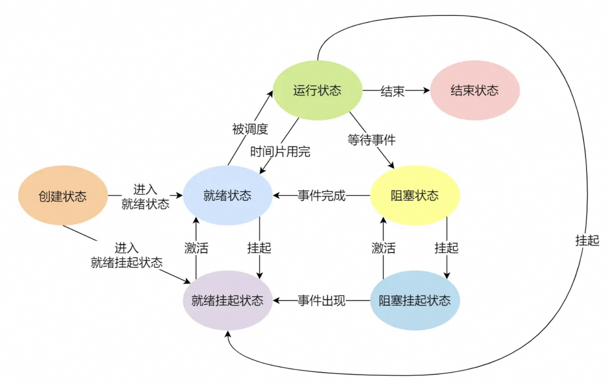
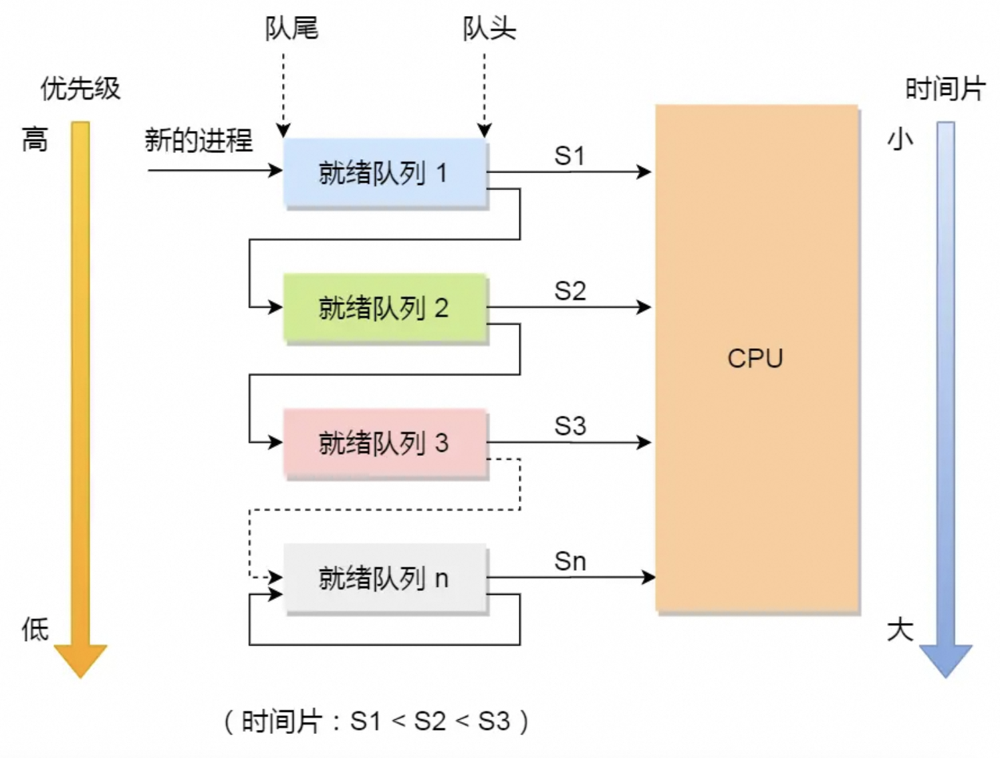
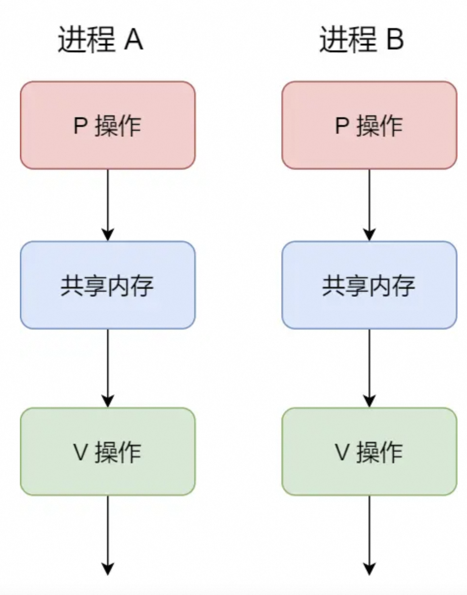
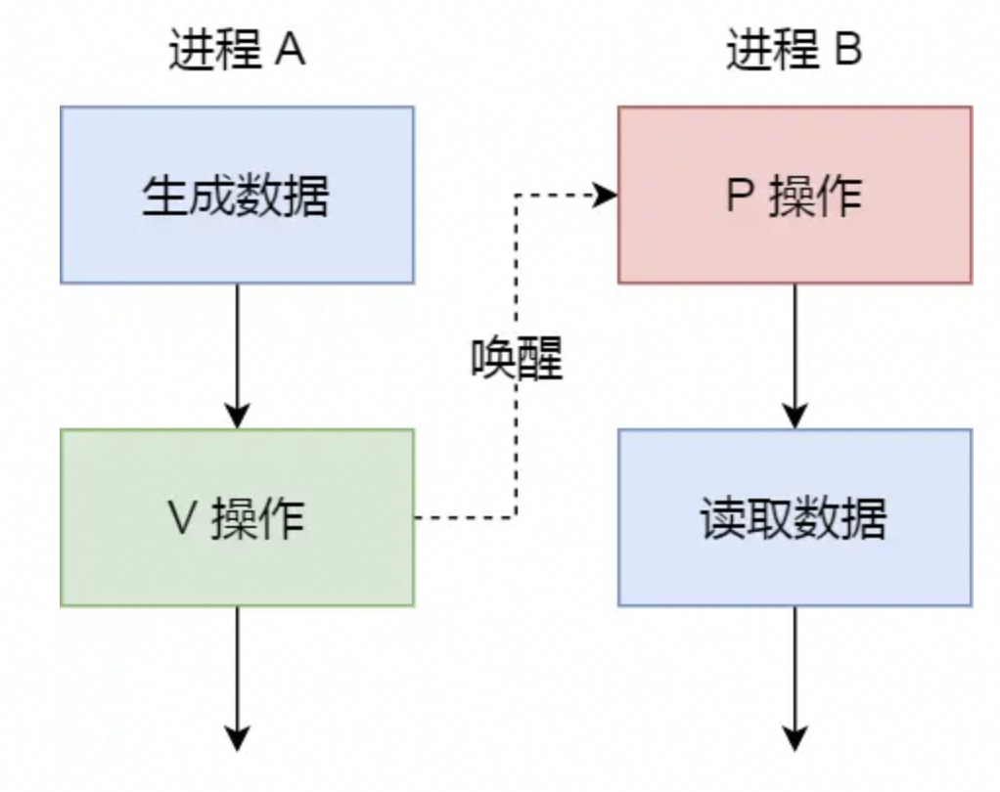
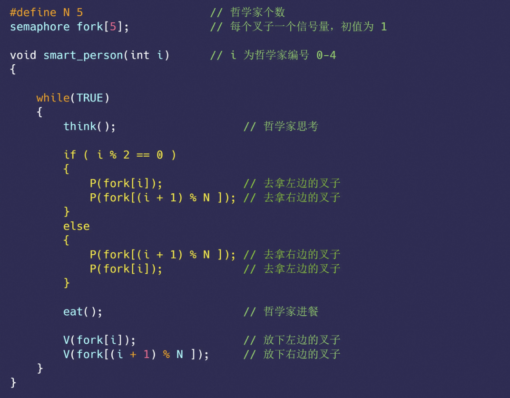
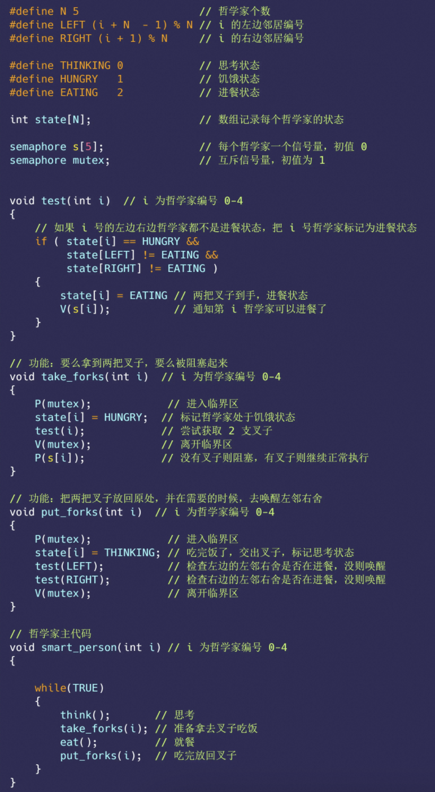
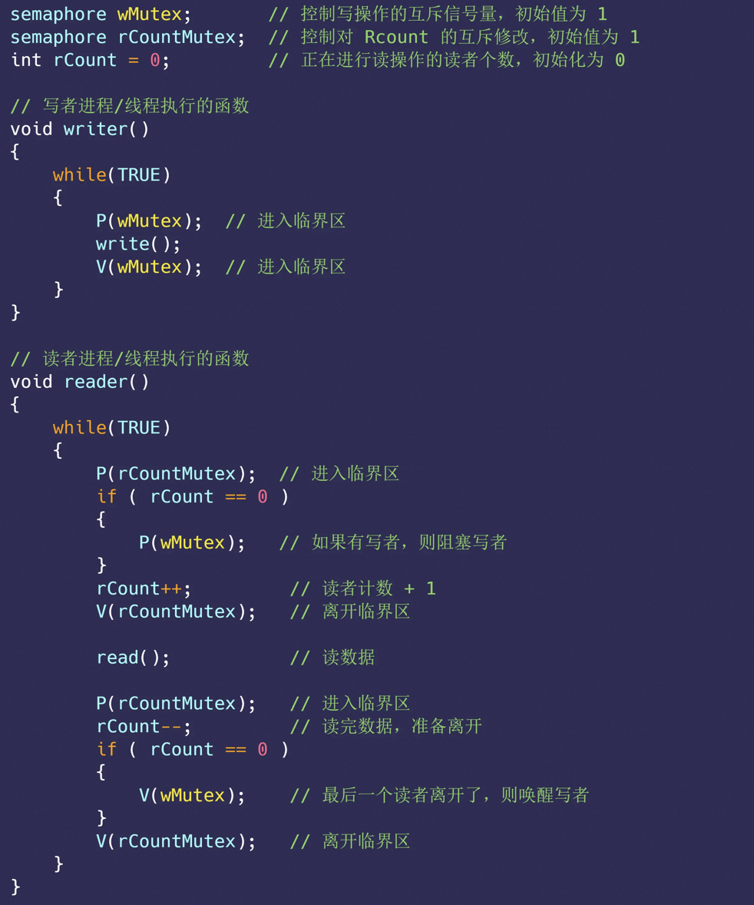
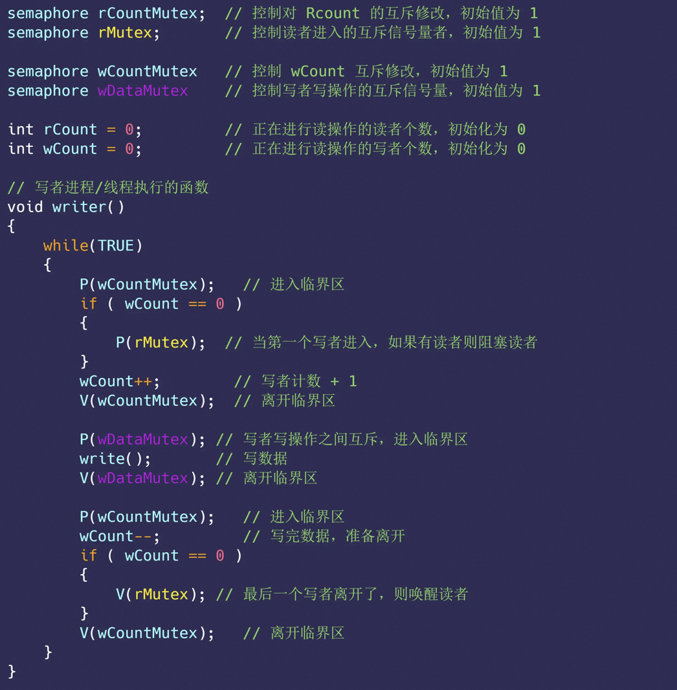
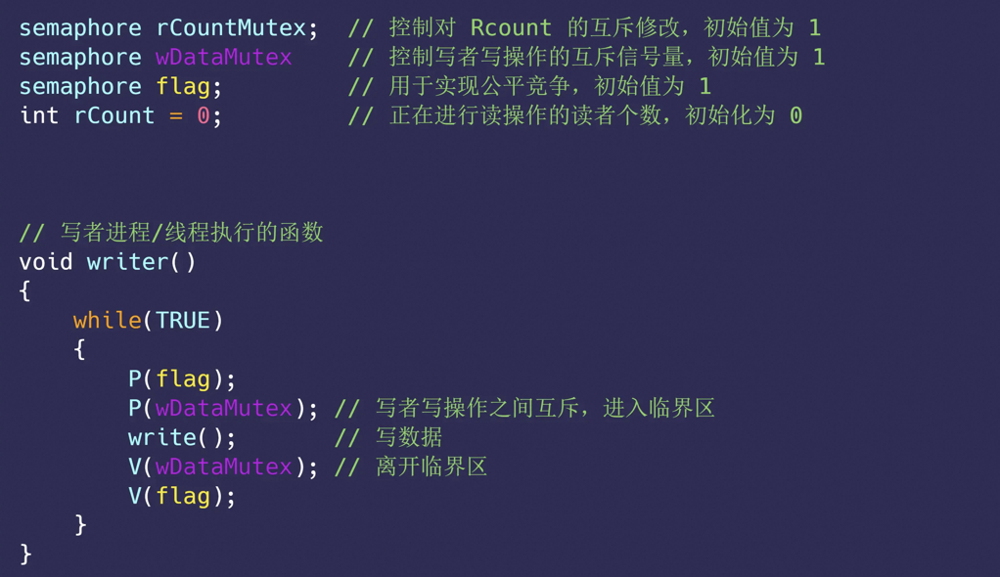
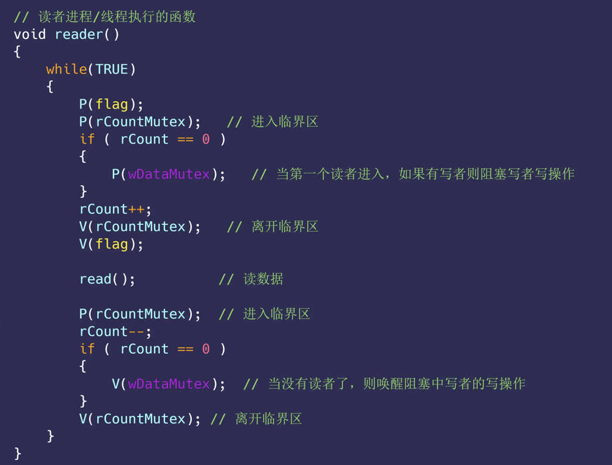

## 进程与线程的基础知识

1. 任务：

   1. 类型：进程、线程、中断
   2. 对应上下文切换：根据任务的不同可以划分成 进程上下文切换、线程上下文切换和中断上下文切换

2. 进程

   1. 进程的状态：

      

      1. 阻塞状态：该进程正在等待某一事件发生（如等待输入/输出操作的完成）而暂时停止运行，这时，即使给它CPU控制权，它也无法运行

      2. 挂起状态：进程没有实际占用物理内存的状态（指防止被阻塞的进程过多，占用过多的物理内存从而将被阻塞的进程对应的物理内存空间换出到磁盘中的情况）

         * 阻塞挂起状态：进程在外存（硬盘）并等待某个事件的出现；
         * 就绪挂起状态：进程在外存（硬盘），但只要进入内存，即刻立刻运行；

         导致进程挂起的原因：

         * 通过 sleep 让进程间歇性挂起，其工作原理是设置一个定时器，到期后唤醒进程。
         * 用户希望挂起一个程序的执行，比如在 Linux 中用 `Ctrl+Z` 挂起进程；

   2. 进程的控制结构（*process control block，**PCB ，进程存在的唯一标识符**）

      1. 内容：**进程描述信息**（**进程标识符（唯一）**、用户标识符）、**进程控制和管理信息**（进程当前状态和进程优先级）、**资源分配清单**（使用的地址空间信息、文件列表、IO设备等）、**CPU状态**（当前进程对应占用CPU时的各个寄存器的值，以便后续重新执行进程时可以从断点处继续执行）
      2. 组织形式：
         * 通过**链表**的形式组织PCB，并根据进程的状态将相同状态的进程链接在一起，组成各种队列，如就绪队列、阻塞队列等。（一般选择链表，对于进程的创建和销毁更灵活）
         * 通过索引的方式组织PCB，将同一状态的进程组织在一个索引表中，索引表项指向相应的 PCB，不同状态对应不同的索引表。

   3. 进程的控制：进程的**创建、终止、阻塞、唤醒**的过程

      1. 创建进程：
         1. 父子进程：允许一个进程创建另一个进程、子进程继承父进程所拥有的资源；
         2. 步骤：创建一个空的P CB并填写进程相关的描述信息和控制管理信息、为此进程分配运行时所必需的资源、插入就绪队列等到调度
      2. 终止进程：
         1. 终止方式：**正常结束、异常结束、外界干预（kill）**
         2. 父子进程：**子进程被终止则将继承的资源全部还给父进程；父进程被终止则其子进程变成孤儿进程，并由1号进程收养，由1号进程完成对应的状态收集。**
         3. 步骤：查找需要被终止的进程对应的PCB、若其处于执行状态则立刻终止执行并将CPU资源分配给其他进程、若其有子进程则子进程被1号进程收养、释放此进程的所有资源给操作系统、删除PCB
      3. 阻塞进程
         1. 阻塞方式：当当前进程需要等待某一事件完成时，**可以调用阻塞语句将自己阻塞等待**，**并且只能由另一个进程唤醒**
         2. 步骤：找到需要阻塞的进程对应的PCB、若其在执行状态则**保护现场并将其转变为阻塞状态**停止执行、将PCB添加到阻塞队列中
      4. 唤醒进程
         1. 唤醒方式：**处于阻塞状态的进程不可能自己唤醒自己，只有当当前进程期待的事件发生时，由发现者进程用唤醒语句唤醒被阻塞的进程**；进程的阻塞和唤醒是一对功能相反的语句，如果某个进程调用了阻塞语句，则必有一个与之对应的唤醒语句。
         2. 步骤：在阻塞队列中找到对应的PCB、从阻塞队列中移除并将状态设置为就绪状态、将PCB添加到就绪队列中等待执行

   4. 进程的上下文切换（CPU上一个进程运行切换到另一个进程运行，**看似并行实际上并发**）

      1. CPU的上下文切换
         1. CPU上下文：**CPU寄存器（CPU内部的一块缓存）和程序计数器（保存当前执行的指令位置或即将执行的下一条指令的位置）**
         2. 切换：系统内核将前一个任务对应的CPU上下文保存起来并加载下一个任务的CPU上下文到寄存器和程序计数器中，最后跳转到程序计数器的位置运行新任务

      2. 进程上下文切换：**进程由内核管理和调度，仅仅存在于内核态**
         1. 进程上下文：**进程的上下文切换不仅包含了虚拟内存、栈、全局变量等用户空间的资源，还包括了内核堆栈、寄存器等内核空间的资源**，一般**保存在进程对应的PCB中**
         2. 进程上下文切换：保存当前进程的上下文信息到PCB，将下一个进程的上下文从PCB中取出并恢复到CPU中
         3. 发生场景：当前进程在CPU执行对应的时间片耗尽、高优先级的进程使得当前进程被挂起、进程主动sleep、进程所需要的资源不够被挂起当资源满足时再执行、硬件中断使得进程被挂起并在CPU中执行内核中的中断处理程序

3. 线程：

   1. 定义：**进程当中的一套执行流程、线程之间可以并发运行并且共享相同的地址空间**，即**同一个进程内多个线程之间可以共享代码段、数据段、打开的文件等资源，但每个线程各自都有一套独立的寄存器和栈，这样可以确保线程的控制流是相对独立的**。当进程只拥有一个线程时进程就等同于线程。

   2. 优点：进程中可以存在多个线程、线程并发执行、线程共享地址空间和文件等资源

      缺点：在C/C++中一个进程中的线程崩溃会导致其余的线程也崩溃（java中不会）

   3. 线程的状态：就绪、阻塞、执行

   4. 线程的上下文切换：线程是CPU调度的基本单位，线程除了共享资源外还有需要保存的私有数据

      1. 若要切换的两个线程属于同一个进程：**进程对应的共享数据不需要切换，仅切换线程的私有数据如寄存器和栈**（开销更小）
      2. 若要切换的两个线程不属于同一个进程：等同于进程的上下文切换

   5. ==线程的实现==：

      1. 用户线程与内核线程的关系：**一对多、一对一、多对一**；在某些情况下，为了兼容性、性能或扩展到需要，用户级线程需要映射到内核线程上，这种映射是比较抽象的概念，由用户空间的线程库来实现，内核线程可以视作是用户线程的执行实体，用户线程的创建、调度、同步最终会变成内核线程的操作
      2. 用户线程：在用户空间实现的线程，不由内核管理、**由用户态的线程库管理**
         1. 线程控制块TCB：由线程库实现与管理（线程的创建、终止、同步和调度，速度很快），操作系统不参与，**每个进程都有其私有的线程控制块来跟踪记录其各个线程的状态信息，操作系统仅仅能看到进程的PCB而看不到其中线程的TCB**。常见的与内核线程的对应关系是**多对一**。
         2. 优点：TCB由用户级线程库函数来维护，可用于不支持线程技术的操作系统；用户线程的切换速度更快
         3. 缺点：
            * 操作系统不参与线程的调度，若一个进程中的一个线程发起了系统调用而阻塞，则此进程中的所有其他线程都不能在执行
            * 当一个线程开始运行后，除非其主动交出CPU使用权，其他的线程是没有办法中断当前线程的执行，即当前进程中的其他线程无法运行
            * 线程的执行速度更慢，CPU的时间片是分配给进程的，多线程会使得每个线程的时间片较少，执行变慢
      3. 内核线程：在内核空间时间的线程，由内核管理
         1. **内核线程是由操作系统管理的，线程对应的 TCB 自然是放在操作系统里的，这样线程的创建、终止和管理都是由操作系统负责。**内核线程的模型是一对一的关系，一个用户线程对应一个内核线程
         2. 优点：一个进程中的内核线程发起系统调用而阻塞并不会影响其他内核线程的执行；CPU时间片分配给线程，多线程的进程获取更多的执行时间
         3. 缺点：线程的创建、终止、切换通过系统调用的方式进行，系统开销大；由内核来维护进程和线程的开销信息
      4. 轻量级进程LWP：在内核中支持用户线程
         1. **轻量级进程（\*Light-weight process，LWP\*）是内核支持的用户线程，一个进程可有一个或多个 LWP，每个 LWP 是跟内核线程一对一映射的，也就是 LWP 都是由一个内核线程支持，而且 LWP 是由内核管理并像普通进程一样被调度**。在LPW上也可以执行用户线程
         2. 与普通进程的区别：**LWP与普通进程的区别也在于它只有一个最小的执行上下文和调度程序所需的统计信息**。一般来说，一个进程代表程序的一个实例，而 LWP 代表程序的执行线程，因为一个执行线程不像进程那样需要那么多状态信息，所以 LWP 也不带有这样的信息。
         3. 与用户线程的对应关系：
            1. 1：1模式：**一个用户线程对应到一个LWP再对应到一个内核线程**；可以实现并行但是创建线程的开销较大
            2. N：1模式：**多个用户线程对应到一个LWP再对应到一个内核线程**；上下文切换发生在用户空间效率高但是无法充分利用CPU（用户空间中一个线程阻塞了其他的线程也无法执行）
            3. N：N模式：**多个用户线程对应到多个 LWP，LWP 再一一对应到内核线程**；大部分上下文切换发生在用户空间单多个线程又可以充分利用多核CPU
            4. 组合模式：一个进程中可以使用同时多种模式来调节内核线程的数目从而达到物理并行和逻辑并行的最佳方案

4. 线程与进程的对比

   1. 对比：
      * **进程是资源（包括内存、打开的文件等）分配的单位，线程是 CPU 调度的单位；**
      * **进程拥有一个完整的资源平台，而线程只独享必不可少的资源**，如寄存器和栈；
      * 线程同样具有就绪、阻塞、执行三种基本状态，同样具有状态之间的转换关系；
      * 线程能减少并发执行的时间和空间开销；
   2. 线程比进程节省开销的原因：
      * 线程的创建时间更快，进程创建涉及资源管理信息但是线程创建仅仅是共享资源管理信息
      * 线程的终止时间更快，线程终止释放的资源相较而言少很多
      * 同一个进程内的线程切换比进程切换快，进程切换涉及页表切换开销较大、线程属于同一个地址空间不涉及页表切换
      * 同一个进程内的线程共享内存资源和文件资源，线程间的数据传递不需要经过内核使得数据传输效率更高
   3. 一个进程可以创建多少个线程：进程的虚拟内存空间上限（进程里创建一个线程需要多少的虚拟空间大小）、系统参数限制（系统支持的最大线程数、系统全局PID数值限制（默认32768）、限制一个进程可以拥有的VMA数量）
      * 32 位系统，用户态的虚拟空间只有 3G，如果创建线程时分配的栈空间是 10M，那么一个进程最多只能创建 300 个左右的线程。
      * 64 位系统，用户态的虚拟空间大到有 128T，理论上不会受虚拟内存大小的限制，而会受系统的参数或性能限制。
   4. 线程崩溃了进程也一定崩溃吗：
      1. 如果线程是因为非法访问内存引起的崩溃，那么进程肯定会崩溃。因为在进程中，**各个线程的地址空间是共享的**，如果某个线程对地址的非法访问就会导致内存的不确定性，进而可能会影响到其他线程，操作系统会认为这很可能导致一系列严重的后果，于是让整个进程崩溃
      2. 进程如何崩溃：通过操作系统向进程发送信号实现，如果线程对于此信号定义了自己的信号处理函数则执行进行保存资源等操作再退出，否则执行默认的操作直接退出。
      3. JVM在发生例如栈溢出或者访问空指针时为什么不会崩溃：**因为 JVM 自定义了自己的信号处理函数，拦截了 SIGSEGV 信号，针对这两者不让它们崩溃**（恢复了线程的执行，并抛出 StackoverflowError 和 NPE）。

5. 调度（操作系统选择进程运行的程序，此处的**进程指主线程，线程是操作系统的基本调度单位**）

   1. 调度时间：进程的生命周期中，由一个运行状态到另一个运行状态变化的时候会触发一次调度

   2. 调度算法分类：

      * 非抢占式调度算法：挑选一个进程运行，直到此进程被阻塞或者推出才挑选另一个进程，不考虑时钟中断
      * 抢占式调度算法/时间片机制：挑选一个进程运行，但仅仅运行某段时间，当时间耗尽后进程仍然在执行则将其挂起并从就绪队列中重新挑选一个进程执行，此机制需要在时钟间隔的末尾发生**时钟中断**来将CPU控制返回给调度程序调度

   3. 调度原则：

      * **CPU 利用率**：调度程序应确保 CPU 是始终匆忙的状态，这可提高 CPU 的利用率；
      * **系统吞吐量**：吞吐量表示的是单位时间内 CPU 完成进程的数量，长作业的进程会占用较长的 CPU 资源，因此会降低吞吐量，相反，短作业的进程会提升系统吞吐量；
      * **周转时间**：周转时间是进程运行+阻塞时间+等待时间的总和，一个进程的周转时间越小越好；
      * **等待时间**：这个等待时间不是阻塞状态的时间，而是进程处于就绪队列的时间，等待的时间越长，用户越不满意；
      * **响应时间**：用户提交请求到系统第一次产生响应所花费的时间，在交互式系统中，响应时间是衡量调度算法好坏的主要标准。

   4. 调度算法（单核CPU）

      1. 先来先服务**First Come First Serve, FCFS**

         1. 原理：**每次从就绪队列选择最先进入队列的进程，然后一直运行，直到进程退出或被阻塞，才会继续从队列中选择第一个进程接着运行**
         2. 优缺点：FCFS 对长作业有利，适用于 CPU 繁忙型作业的系统，而不适用于 I/O 繁忙型作业的系统

      2. 最短作业优先**Shortest Job First, SJF**

         1. 原理：**优先选择运行时间最短的进程来运行**
         2. 优缺点：有助于提高系统吞吐量但是对长作业不利，极端情况下会使得长作业不被执行

      3. 高响应比优先Highest Response Ratio Next, HRRN

         1. 原理：**每次进行进程调度时，先计算「响应比优先级」，然后把「响应比优先级」最高的进程投入运行**；响应比优先级 = （等待时间 + 要求服务时间）/要求服务时间
         2. 优缺点：是理想的算法无法实现，因为要求服务时间无法计算

      4. 时间片轮转**Round Robin, RR**

         1. 原理：**每个进程被分配一个时间段，称为时间片（Quantum），即允许该进程在该时间段中运行。**如果时间片用完，进程还在运行，那么将会把此进程从 CPU 释放出来，并把 CPU 分配给另外一个进程；如果该进程在时间片结束前阻塞或结束，则 CPU 立即进行切换；一般来说，时间片设为 `20ms~50ms` 通常是一个比较合理的折中值。

      5. 最高优先级**Highest Priority First，HPF**

         1. 优先级分类：静态优先级（创建进程时就确定并且一直不变）、动态优先级（随着进程运行时间的增加就降低优先级、随着进程等待时间的增加就提高优先级）
         2. 处理高优先级进程的方式：
            * 非抢占式：当就绪队列中出现优先级高的进程，运行完当前进程，再选择优先级高的进程。
            * 抢占式：当就绪队列中出现优先级高的进程，当前进程挂起，调度优先级高的进程运行。
         3. 缺点：可能导致低优先级的进程永远无法运行

      6. 多级反馈队列**Multilevel Feedback Queue**（FCFS+SJF+RR+HPF）

         

         1. 原理：
            * 设置了多个队列，赋予每个队列不同的优先级，每个**队列优先级从高到低**，同时**优先级越高时间片越短**；
            * 新的进程会被放入到第一级队列的末尾，按先来先服务的原则排队等待被调度，如果在第一级队列规定的时间片没运行完成，则将其转入到第二级队列的末尾，以此类推，直至完成；
            * 当较高优先级的队列为空，才调度较低优先级的队列中的进程运行。如果进程运行时，有新进程进入较高优先级的队列，则停止当前运行的进程并将其移入到原队列末尾，接着让较高优先级的进程运行；


## 进程间的通信

6. 进程的通信方式：进程的用户地址空间是独立的但是内核空间是每个进程共享的，要通过内核通信

   1. 管道：**管道中的数据传输是单向的**，

      1. 种类：**匿名管道**（如 ps auxf | grep mysql 中的 `|`，功能是将前一个命令的输出当作后一个命令的输入 ）；**命名管道**（FIF O，数据是先进先出的传播方式，数据写入后只有数据被读出的对应的写入命令才能正常退出）
      2. 实现：**数据存储在内核中、遵循先进先出的原则；管道的通信方式效率很低、不适合频繁的交换数据**
         1. 匿名管道：**通信范围是父子关系的进程**。匿名管道是是特殊的文件（只存在于内存不存在于文件系统中，是内核里的一段缓存，管道中的数据是无格式的流且大小受限），`int pipe(int fd[2])`返回两个描述符，读取端描述符`f[0]`和写入端描述符`f[1]`，**进程间通过管道进行通信的原理是使的父子进程共享文件描述符（fork创建子进程会继承父进程的文件资源）并且会关闭父进程的读端和子进程的写端来避免冲突，即是单方向通信的，若想要实现双方向通信则应该创建两个管道**。但是**shell中的A｜B实际上是创建了A和B两个shell父进程的子进程并且在两个子进程间建立管道**，因此shell中要避免创建多个管道来减少创建子进程的开销。匿名管道的生命周期随着进程的创建而创建、进程的结束而结束。
         2. 命名管道：通信范围是不相关的进程。命名管道提前创建了一个类型为管道的设备文件（**也存储在内核中**），进程对应的资源中只要有这个设备文件就可以通信

   2. 消息队列：

      1. 实现： **消息队列是保存在内核中的消息链表**，在发送数据时，会分成一个一个独立的数据单元，也就是消息体（数据块），消息体是用户自定义的数据类型，消息的发送方和接收方要约定好消息体的数据类型，所以每个消息体都是固定大小的存储块，不像管道是无格式的字节流数据。如果进程从消息队列中读取了消息体，内核就会把这个消息体删除。**消息队列生命周期随内核，如果没有释放消息队列或者没有关闭操作系统，消息队列会一直存在**。
      2. 不足：**消息队列不适合比较大数据的传输**；**消息队列通信过程中，存在用户态与内核态之间的数据拷贝开销**。

   3. 共享内存：

      1. 实现：**从多个进程的虚拟地址空间中拿出一块空间并映射到相同的物理内存中，减少数据拷贝来提升通信速度**。
      2. 问题：多个进程同时修改共享内存则可能发生冲突；需要信号量或者锁进行处理

   4. 信号：**异常情况下的进程间通信机制**

      1. 信号：信号是在系统中预先定义的、是进程间通信机制中**唯一的异步通信机制**，可以在任意一个时刻给某一进程发信号

      2. 信号事件的来源：硬件来源（如键盘ctrl+c）、软件来源（如kill+信号+pid）

      3. 进程对于信号的处理方式：

         1. 执行默认操作：每个信号都有对应的默认操作

         2. 捕捉信号并执行预先定义的信号处理函数

         3. 忽略一些不希望处理的信号，但SIGKILL（立即终止目标进程）和SEGSTOP（暂停目标进程的执行）无法忽略

   5. Socket：跨网络与不同主机上的进程通信/同主机上的进程通信

      1. 创建socket：`int socket(int domain, int type, int protocal)`三个参数分别执行协议族（IPV4 IPV6 本机）、通信特性（字节流、数据报、套接字）、通信协议（不使用）
      2. socket的通信方式：
         * 实现 TCP 字节流通信： socket 类型是 AF_INET 和 SOCK_STREAM；
         * 实现 UDP 数据报通信：socket 类型是 AF_INET 和 SOCK_DGRAM；
         * 实现本地进程间通信： 「本地字节流 socket 」类型是 AF_LOCAL 和 SOCK_STREAM，「本地数据报 socket 」类型是 AF_LOCAL 和 SOCK_DGRAM。另外，AF_UNIX 和 AF_LOCAL 是等价的，所以 AF_UNIX 也属于本地 socket；socket绑定的是本地文件。


## 线程间的冲突

7. 线程间的竞争与协作
   1. 互斥：当多线程处于**竞争条件**下操作共享变量时输出的结果**存在不确定性**，此共享变量属于的代码片段即为**临界区**，是不能给多线程共同执行的。执行临界区代码的多线程应该是**互斥的**，一个线程在临界区执行其他线程应该被阻止。互斥同样适用于多进程。
   2. 同步：**并发进程/线程在一些关键点上可能需要互相等待与互通消息，这种相互制约的等待与互通信息称为进程/线程同步**。
   3. 互斥与同步的实现方式与使用：锁；信号量


## 信号量

8. 信号量：**用于防止多进程竞争共享资源**，使得共享资源在任意时刻只能被一个进程访问；**信号量表示的是资源的数量**

   1. P操作：将信号量减去1，如果结果**小于0**则表示资源已经被全部占用，进程需要阻塞等待（保存CPU状态、将对应的TCB加入当前信号量的等待队列中、将线程的状态为等待、执行调度程序）；如果结果**大于等于0**则表示还有资源可用，进程可以正常执行

   2. V操作：将信号量加上1，如果结果**小于等于0**则表示有阻塞的进程则将进程唤醒（移除当前信号量的队首元素、将TCB插入就绪队列、将线程状态设置为就绪状态）；如果结果**大于0**则表示没有阻塞中的进程

   3. **P操作在进程进入共享资源之前进行、V操作在进程离开共享资源之后进行，成对出现**

   4. 信号量初始化为1代表**互斥信号量**、保证共享内存在同一时间只有一个进程在访问；信号量初始化为0代表**同步信号量**、多进程进行合作同步对于共享数据进行操作；

<div>
  
  
</div>

9. 生产者-消费者问题
   1. 问题描述：**生产者**在生成数据后，放在一个缓冲区中；**消费者**从缓冲区取出数据处理；任何时刻，**只能有一个**生产者或消费者可以访问缓冲区；
   2. 分析：互斥问题（缓冲区任意时刻只能有一个线程访问是临界区代码）+同步问题（消费者只有在生产者产出数据后才可以读取、生产者在缓冲区满时只有等消费者取出数据后才能继续生产）
   3. 所需要的信号量：互斥信号量（实现互斥访问缓存区，初始值为1）、同步信号量（表示缓冲区是否为空，初始为0表示空）、同步信号量（表示缓冲区是否还有空位，初始为n表示缓冲区满）

```java
#define N 100
semaphore mutex = 1;         //临界区的互斥访问
semaphore emptyBuffers = N;  //表示缓冲区中空位的个数
semaphore fullBuffers = 0;   //表示缓冲区中已经被装满数据的个数
//生产者
void producer(){
  while(true){
    //空槽个数-- 剩余的空槽个数大于等于0则表示可以生产数据 
    P(emptyBuffers);  
    P(mutex);    //获取锁，占用临界区
    将生产的数据放入缓冲区
    V(mutex);
    //满槽个数++
    V(fullBuffers);
  }
}
//消费者
void consumer(){
  while(true){
    //满槽个数-- 剩余数据的个数大于等于0则表示可以消费数据 
    P(fullBuffers);  
    P(mutex);    //获取锁，占用临界区
    从缓冲区中读取数据
    V(mutex);
    //空槽个数++ 
    V(emptyBuffers);
  }
}
```

* 如果消费者线程一开始执行 `P(fullBuffers)`，由于信号量 `fullBuffers` 初始值为 0，则此时 `fullBuffers` 的值从 0 变为 -1，说明缓冲区里没有数据，消费者只能等待

* 接着，轮到生产者执行 `P(emptyBuffers)`，表示减少 1 个空槽，如果当前没有其他生产者线程在临界区执行代码，那么该生产者线程就可以把数据放到缓冲区，放完后，执行 `V(fullBuffers)` ，**信号量 `fullBuffers` 从 -1 变成 0，表明有「消费者」线程正在阻塞等待数据，于是阻塞等待的消费者线程会被唤醒**
* 消费者线程被唤醒后，如果此时没有其他消费者线程在读数据，那么就可以直接进入临界区，从缓冲区读取数据。最后，离开临界区后，把空槽的个数 + 1。

10. 哲学家就餐问题

1. 问题描述：5个哲学家围成一圈就餐，每两个人之间才有一个叉子，哲学家只有拿到两个叉子了才能吃饭，如何使得哲学家们的动作有序进行，而不会出现有人永远拿不到叉子呢？

2. 解决方案1：**让偶数编号的哲学家「先拿左边的叉子后拿右边的叉子」，奇数编号的哲学家「先拿右边的叉子后拿左边的叉子」**

   

3. 解决方案2:**用一个数组 state 来记录每一位哲学家的三个状态，分别是在进餐状态、思考状态、饥饿状态（正在试图拿叉子）。**那么，**一个哲学家只有在两个邻居都没有进餐时，才可以进入进餐状态。**



11. 读者写者问题

1. 问题描述：读者只会读取数据，不会修改数据，而写者即可以读也可以修改数据。「读-读」允许：同一时刻，允许多个读者同时读；「读-写」互斥：没有写者时读者才能读，没有读者时写者才能写；「写-写」互斥：没有其他写者时，写者才能写

2. 解决方法1：读者优先

   

3. 解决方法2：写者优先

   

   

   4. 解决方案3:公平策略（优先级相同、读者写者互斥访问、只有一个写者访问临界区、可以有多个读者同时访问临界区）

      




## 如何避免死锁、悲观锁、乐观锁

12. 锁
    1. 原理：任何想进入临界区的线程，必须先执行加锁操作。若加锁操作顺利通过，则线程可进入临界区；在完成对临界资源的访问后再执行解锁操作，以释放该临界资源。
    2. 忙等待锁/自旋锁**当线程无法获取到锁时就一直等待（忙等），利用CPU周期不断检测，直到锁可用**。**在单处理器上，自旋锁需要抢占式的调度策略**（利用CPU周期中段一个线程并运行其他的线程），若是非抢占式的则自旋的线程永远不会主动放弃CPU
    3. 无等待锁：当没获取到锁的时候，就把当前线程放入到锁的等待队列，然后执行调度程序，把 CPU 让给其他线程执行。
13. 死锁

1. 概念：**两个线程都在等待对方释放锁**，在没有外力的作用下，这些线程会一直相互等待，就没办法继续运行，这种情况就是发生了**死锁**。
2. 条件（同时满足）：
   * **互斥条件**：多个线程不能同时使用同一个资源
   * **持有并等待条件**：一个线程在持有一个资源的情况下申请另一个资源（若另一个资源已经被另一个线程持有了则此线程将在持有资源的情况下一直等待）
   * **不可剥夺条件**：一个线程已经持有了资源，则在自己使用完成之前不能被其他线程获取（主动释放）
   * **环路等待条件**：在发生死锁时，两个线程获取资源的顺序构成了环路
3. 如何排查：java中使用jstack+pid来分析堆栈，确认是哪几个线程一直没有变化；ddb工具查看栈帧
4. 避免方法：使用资源有序分配法破坏环路等待条件（如A和B以相同的顺序来申请想要的资源）

13. 锁的种类与使用
    1. 种类：**互斥锁、自旋锁、读写锁、乐观锁、悲观锁**
    2. 互斥锁与自旋锁：**当加锁失败时，互斥锁用「线程切换」来应对，自旋锁则用「忙等待」来应对**
       - **互斥锁**加锁失败后，线程会**释放 CPU** ，给其他线程；**对于互斥锁加锁失败而阻塞的现象，是由操作系统内核实现的**。当加锁失败时，内核会将线程置为「睡眠」状态（从用户态切换到内核态），等到锁被释放后，内核会在合适的时机唤醒线程，当这个线程成功获取到锁后，于是就可以继续执行，存在两次上下文切换的开销。因此，**如果能确定被锁住的代码执行时间很短，就不应该用互斥锁，而应该选用自旋锁，否则使用互斥锁。**不然会导致系统开销时间比代码执行时间长。
       - **自旋锁**加锁失败后，线程会**忙等待**（`PAUSE` 指令，相当于while循环），直到它拿到锁；**自旋锁是通过 CPU 提供的原子指令  `CAS` 函数（*Compare And Swap*），在「用户态」完成加锁和解锁操作，不会主动产生线程上下文切换**，所以相比互斥锁会更快开销更小。在多核系统下一般不会主动产生线程切换，适合异步、协程等在用户态切换请求的编程方式，但如果被锁住的代码执行时间过长，自旋的线程会长时间占用 CPU 资源，所以自旋的时间和被锁住的代码执行的时间是成「正比」的关系。
    3. 读写锁：如果只读取共享资源用「读锁」加锁，如果要修改共享资源则用「写锁」加锁。**读写锁适用于能明确区分读操作和写操作的场景，并且在读多写少的场景下更有优势**。写锁是独占锁；读锁是共享锁。
       * 工作原理：当「写锁」没有被线程持有时，多个线程能够并发地持有读锁；一旦「写锁」被线程持有后，读线程的获取读锁的操作会被阻塞，而且其他写线程的获取写锁的操作也会被阻塞。
       * 读优先锁：读锁能被更多的线程持有；当读线程 A 先持有了读锁，写线程 B 在获取写锁的时候，会被阻塞，并且在阻塞过程中，后续来的读线程 C 仍然可以成功获取读锁，最后直到读线程 A 和 C 释放读锁后，写线程 B 才可以成功获取写锁。
       * 写优先锁：优先服务写线程；当读线程 A 先持有了读锁，写线程 B 在获取写锁的时候，会被阻塞，并且在阻塞过程中，后续来的读线程 C 获取读锁时会失败，于是读线程 C 将被阻塞在获取读锁的操作，这样只要读线程 A 释放读锁后，写线程 B 就可以成功获取写锁。
    4. 悲观锁：认为**多线程同时修改共享资源的概率比较高，于是很容易出现冲突，所以访问共享资源前，先要上锁**。
    5. 乐观锁：假定冲突的概率很低，**先修改完共享资源，再验证这段时间内有没有发生冲突，如果没有其他线程在修改资源，那么操作完成，如果发现有其他线程已经修改过这个资源，就放弃本次操作**。**乐观锁全程并没有加锁，所以它也叫无锁编程**。
    6. 乐观锁虽然去除了加锁解锁的操作，但是一旦发生冲突，重试的成本非常高，所以**只有在冲突概率非常低，且加锁成本非常高的场景时，才考虑使用乐观锁。


## 问题

1. 为什么要区分三种线程的状态、三种线程之间有什么关联和对应的进程之间有什么关联


